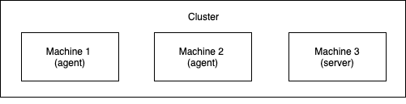
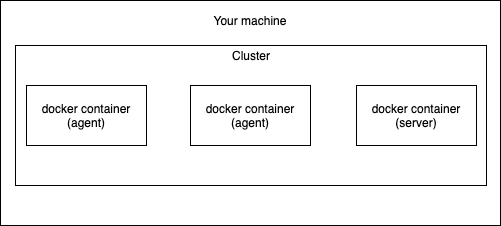

<text-box variant='learningObjectives' name='Learning Objectives'>

After this section you

- are able to create and run a Kubernetes cluster locally with k3d

- can deploy a simple application to Kubernetes

</text-box>

## What are microservices?

In this course, we'll talk about microservices and create microservices. Before we get started with anything else we'll need to define what a microservice is. Currently, there are many different definitions for microservices.

For this course, we'll choose the definition set by Sam Newman in [Building Microservices](https://www.oreilly.com/library/view/building-microservices/9781491950340/): "**Microservices are small, autonomous services that work together**". The opposite of a microservice is a service that is self-contained and independent called a [Monolith](https://en.wikipedia.org/wiki/Monolithic_application).

The misconception of microservices being a large number of extremely small services is proliferated by large enterprises. If you have an extremely large enterprise where teams don't even know the existence of other teams you may have an unconventionally large number of microservices. Due to the insanity of a large number of small services without any good reasoning, we witnessed the term monolith trending in 2020.

- "Monoliths are the future" - Kelsey Hightower, Staff Developer Advocate at Google, ["Monoliths are the Future"](https://changelog.com/posts/monoliths-are-the-future)

For the context of this unpopular opinion, Kelsey Hightower points out at "The problem people try to solve with microservices doesn't really line up with reality", leading to _Distributed Monoliths_ where you have a large number of microservices without a good reason.

- "Run a small team, not a tech behemoth? Embrace the monolith and make it majestic. You Deserve It!" - David Heinemeier Hansson, cofounder & CTO at Basecamp, ["The Majestic Monolith"](https://m.signalvnoise.com/the-majestic-monolith/)

And this evolves into ["The Majestic Monolith can become The Citadel"](https://m.signalvnoise.com/the-majestic-monolith-can-become-the-citadel/) with the following: "next step is The Citadel, which keeps the Majestic Monolith at the center, but supports it with a set of Outposts, each extracting a small subset of application responsibilities."

When to use microservices? In the following video where Sam Newman and Martin Fowler discuss microservices, the answer is: "When you've got a really good reason".

It also includes the top 3 reasons for using microservices:

- Zero-downtime independent deployability
- Isolation of data and of processing around that data
- Use microservices to reflect the organizational structure

**When To Use Microservices (And When Not To!)**

<iframe width="560" height="315" src="https://www.youtube-nocookie.com/embed/GBTdnfD6s5Q" frameborder="0" allow="accelerometer; autoplay; clipboard-write; encrypted-media; gyroscope; picture-in-picture" allowfullscreen></iframe>

A big topic in the video was also the _Distributed Monolith_, where the services are not independently deployable. This is possibly part of the reason why microservices are so hard to define. A simple definition such as "A microservice is any service that is smaller than a monolith", can be used to claim that a Distributed Monolith is a microservice. So a seemingly microservice architecture that does not have the benefits of a microservice architecture may actually be a disguised monolith.

Since it is so hard to define rather than going first into microservices we should listen to the first two takeaways from the video that are "One should use microservices as a means to obtain a desired outcome rather than for the sake of using a new technology" and "Microservices shouldn't be the default option. If you think a service architecture could help, try it with one of the modules from a very simple monolith typology and let it evolve from there".

However, sometimes during this course, we'll do **arbitrary** splits to our services just to show the features of Kubernetes. So even though we are doing "[microservices](https://www.youtube.com/watch?v=y8OnoxKotPQ)" in this course, a healthy amount of skepticism is required around microservices in the real world. We will see at least one actual and well-justified use case for microservices with service scaling during the course.

## What is Kubernetes?

Let's say you have 3 processes and 2 computers incapable of running all 3 processes. How would you approach this problem?

You'll have to start by deciding which 2 processes go on the same computer and which 1 will be on the different one. How would you fit them? By having the ones demanding the most resources and the least resources on the same machine or having the most demanding be on its own? Maybe you want to add one process and now you have to reorganize all of them. What happens when you have more than 2 computers and more than 3 processes? One of the processes is eating all of the memory and you need to get that away from the "critical-bank-application". Should we virtualize everything? Containers would solve that problem, right? Would you move the most important process to a new computer? Maybe some of the processes need to communicate with each other and now you have to deal with networking. What if one of the computers breaks? What about your Friday plans to visit the local Craft brewery?

What if you could just define "This process should have 6 copies using X amount of resources." and have the 2..N computers working as a single entity to fulfill your request? That's just one thing Kubernetes makes possible.

<blockquote class="twitter-tweet"><p lang="en" dir="ltr">In essence, Kubernetes is the sum of all the bash scripts and best practices that most system administrators would cobble together over time, presented as a single system behind a declarative set of APIs.</p>&mdash; Kelsey Hightower (@kelseyhightower) <a href="https://twitter.com/kelseyhightower/status/1125440400355782657?ref_src=twsrc%5Etfw">May 6, 2019</a></blockquote>

Or more officially:

“Kubernetes (K8s) is an open-source system for automating deployment, scaling, and management of containerized applications. It groups containers that make up an application into logical units for easy management and discovery.” - [kubernetes.io](https://kubernetes.io/)

A container orchestration system such as Kubernetes is often required when maintaining containerized applications. The main responsibility of an orchestration system is the starting and stopping of containers. In addition, they offer networking between containers and health monitoring. Rather than manually doing `docker run critical-bank-application` every time the application crashes, or restarting it if it becomes unresponsive, we want the system to keep the application automatically healthy.

You should already know an orchestration system, _docker compose_, which also takes care of the same tasks; starting and stopping, networking and health monitoring. What makes Kubernetes special is the robust feature set for automating all of it.

Read [this comic](https://cloud.google.com/kubernetes-engine/kubernetes-comic/) and watch the video below to get a fast introduction. You may want to revisit these after this part!

<iframe width="560" height="315" src="https://www.youtube-nocookie.com/embed/Q4W8Z-D-gcQ" frameborder="0" allow="accelerometer; encrypted-media; gyroscope; picture-in-picture" allowfullscreen></iframe>

We will get started with a lightweight Kubernetes distribution. [K3s - 5 less than K8s](https://k3s.io/), offers us an actual Kubernetes cluster that we can run in containers using [k3d](https://github.com/rancher/k3d).

### Kubernetes cluster with k3d

#### What is a cluster?

A cluster is a group of machines, _nodes_, that work together - in this case, they are part of a Kubernetes cluster. Kubernetes cluster can be of any size - a single node cluster would consist of one machine that hosts the Kubernetes control-plane (exposing API and maintaining the cluster) and that cluster can then be expanded with up to 5000 nodes total, as of Kubernetes v1.18.

We will use the term "server node" to refer to nodes with control-plane and "agent node" to refer to the nodes without that role. A basic kubernetes cluster may look like this:



#### Starting a cluster with k3d

We'll use k3d to create a group of Docker containers that run k3s. The installation instructions, or at least a link to them, are in [part 0](/part-0#installing-k3d). The reason for using k3d is that it enables us to create a cluster without worrying about virtual machines or physical machines. With k3d our basic cluster will look like this:



Because the nodes are containers we are going to need to do a little bit of configuring to get those working like we want. We will get to that later. Creating our very own Kubernetes cluster with k3d is done by a single command.

```console
$ k3d cluster create -a 2
```

This created a Kubernetes cluster with 2 agent nodes. As they're in Docker you can confirm that they exist with `docker ps`.

```console
$ docker ps
  CONTAINER ID   IMAGE                            COMMAND                  CREATED          STATUS          PORTS                             NAMES
  b25a9bb6c42f   ghcr.io/k3d-io/k3d-tools:5.4.1   "/app/k3d-tools noop"    56 seconds ago   Up 55 seconds                                     k3d-k3s-default-tools
  19f992606131   ghcr.io/k3d-io/k3d-proxy:5.4.1   "/bin/sh -c nginx-pr…"   56 seconds ago   Up 32 seconds   80/tcp, 0.0.0.0:50122->6443/tcp   k3d-k3s-default-serverlb
  7a8bf6a44099   rancher/k3s:v1.22.7-k3s1         "/bin/k3d-entrypoint…"   56 seconds ago   Up 43 seconds                                     k3d-k3s-default-agent-1
  c85fbcbcf9b2   rancher/k3s:v1.22.7-k3s1         "/bin/k3d-entrypoint…"   56 seconds ago   Up 43 seconds                                     k3d-k3s-default-agent-0
  7191a3bdae7a   rancher/k3s:v1.22.7-k3s1         "/bin/k3d-entrypoint…"   56 seconds ago   Up 52 seconds                                     k3d-k3s-default-server-0
```

When scrolling a bit to the left we also see that port 6443 is opened to "k3d-k3s-default-serverlb", a useful "load balancer" proxy, that'll redirect a connection to 6443 into the server node, and that's how we can access the contents of the cluster. The port on our machine, above 50122, is randomly chosen. We could have opted out of the load balancer with `k3d cluster create -a 2 --no-lb` and the port would be open straight to the server node. Having a load balancer will offer us a few features we wouldn't otherwise have, so let's keep it in.

K3d helpfully also set up a [kubeconfig](https://kubernetes.io/docs/concepts/configuration/organize-cluster-access-kubeconfig/), a file that is used to organize information about clusters, users, namespaces, and authentication mechanisms. The contents of the file can be seen with the command `k3d kubeconfig get k3s-default`.

The other tool that we will be using in this course is [kubectl](https://kubernetes.io/docs/reference/kubectl/). Kubectl is the Kubernetes command-line tool and will allow us to interact with the cluster. Kubectl will read kubeconfig from the location in KUBECONFIG environment value or by default from `~/.kube/config` and use the information to connect to the cluster. The contents include certificates, passwords and the address in which the cluster API. You can set the context with `kubectl config use-context k3d-k3s-default`.

Now kubectl will be able to access the cluster

```console
$ kubectl cluster-info
  Kubernetes control plane is running at https://0.0.0.0:50122
  CoreDNS is running at https://0.0.0.0:50122/api/v1/namespaces/kube-system/services/kube-dns:dns/proxy
  Metrics-server is running at https://0.0.0.0:50122/api/v1/namespaces/kube-system/services/https:metrics-server:https/proxy
```

We can see that kubectl is connected to the container _k3d-k3s-default-serverlb_ through (in this case) port 50122.

If you want to stop / start the cluster you can simply run

```console
$ k3d cluster stop
  INFO[0000] Stopping cluster 'k3s-default'
  INFO[0011] Stopped cluster 'k3s-default'

$ k3d cluster start
  INFO[0000] Using the k3d-tools node to gather environment information
  INFO[0000] Starting existing tools node k3d-k3s-default-tools...
  INFO[0000] Starting Node 'k3d-k3s-default-tools'
  INFO[0001] Starting new tools node...
  INFO[0001] Starting Node 'k3d-k3s-default-tools'
  INFO[0003] Starting cluster 'k3s-default'
  INFO[0003] Starting servers...
  INFO[0003] Starting Node 'k3d-k3s-default-server-0'
  INFO[0010] Starting agents...
  INFO[0010] Starting Node 'k3d-k3s-default-agent-1'
  INFO[0011] Starting Node 'k3d-k3s-default-agent-0'
  INFO[0027] Starting helpers...
  INFO[0027] Starting Node 'k3d-k3s-default-serverlb'
  INFO[0027] Starting Node 'k3d-k3s-default-tools'
  INFO[0035] Injecting records for hostAliases (incl. host.k3d.internal) and for 5 network members into CoreDNS configmap...
  INFO[0038] Started cluster 'k3s-default'
```

For now, **we're going to need the cluster running**, but if we want to remove the cluster we can run `k3d cluster delete`.

## First Deploy

### Preparing for first deploy

Before we can deploy anything we'll need to do a small application to deploy. During the course, you will develop your own application. The technologies used for the application do not matter - for the examples we're going to use [Node.js](https://nodejs.org/en/) but the example application will be offered through GitHub as well as Docker Hub.

Let's launch an application that generates and outputs a hash every 5 seconds or so.

I have prepared one [here](https://github.com/kubernetes-hy/material-example/tree/master/app1), you can test it with `docker run jakousa/dwk-app1`.

To deploy an image, we need the cluster to have access to the image. By default, Kubernetes is intended to be used with a registry. K3d offers `import-images` command, but that won't work when we switch to non-k3d solutions. We will use the familiar registry _Docker Hub_, which we also used in [DevOps with Docker](http://devopswithdocker.com/). If you've never used Docker Hub, it is the place where the Docker client defaults to. E.g. when you run `docker pull nginx`, the nginx image comes from Docker Hub. See the course [DevOps for Docker](https://devopswithdocker.com/) for further details e.g. on pushing your images to Docker Hub if needed.

<text-box name="Example applications" variant="hint">
In the future, the material will use the offered applications in the commands. You may follow along by changing the image to your application. Almost everything is found in the same repository <a href="https://github.com/kubernetes-hy/material-example">https://github.com/kubernetes-hy/material-example</a>.
</text-box>

Now we are finally ready to deploy our first app into Kubernetes!

### Deployment

To deploy an application, we will need to create a [deployment](https://kubernetes.io/docs/concepts/workloads/controllers/deployment/) object with the image.

```console
$ kubectl create deployment hashgenerator-dep --image=jakousa/dwk-app1
  deployment.apps/hashgenerator-dep created
```

This action created a few things for us to look at
- a [deployment](https://kubernetes.io/docs/concepts/workloads/controllers/deployment/) resource and
- a [pod](https://kubernetes.io/docs/concepts/workloads/pods/) resource.

#### What is a Pod?

_Pod_ is an abstraction around one or more containers. Pods provide a context for 1..N containers so that they can share storage and a network. It's very much like how you have used containers to define environments for a single process. They can be thought of as a container of containers. _Most_ of the same rules apply: it is deleted if the containers within stop running and contained files will be lost with it.


Reading through the documentation or searching the internet are not the only ways to find information about the different resources Kubernetes has. We can get access to simple explanations straight from our command line using `kubectl explain RESOURCE` command.

For example, to get a description of what a Pod is and its mandatory fields, we can use the following command.

```console
$ kubectl explain pod
  KIND:     Pod
  VERSION:  v1

  DESCRIPTION:
       Pod is a collection of containers that can run on a host. This resource is
       created by clients and scheduled onto hosts.
```

In Kubernetes, all entities that exist are called [objects](https://kubernetes.io/docs/concepts/overview/working-with-objects/). You can list all objects of a resource with `kubectl get RESOURCE`.

```
$ kubectl get pods
  NAME                               READY   STATUS    RESTARTS   AGE
  hashgenerator-dep-6965c5c7-2pkxc   1/1     Running   0          2m1s
```

#### What is a Deployment resource?

A [deployment](https://kubernetes.io/docs/concepts/workloads/controllers/deployment/) resource takes care of deployment. It's a way to tell Kubernetes what container you want, how they should be running and how many of them should be running.

While we created the Deployment we also created a [ReplicaSet](https://kubernetes.io/docs/concepts/workloads/controllers/replicaset/) object. ReplicaSets are used to tell how many replicas of a Pod you want. It will delete or create Pods until the number of Pods you want is running. ReplicaSets are managed by Deployments and you do not need to manually define or modify them. If you want to manage the number of replicas, you can edit the Deployment and it will take care of modifying the ReplicaSet.

You can view the deployments as follows:

```console
$ kubectl get deployments
  NAME                READY   UP-TO-DATE   AVAILABLE   AGE
  hashgenerator-dep   1/1     1            1           54s
```

1/1 replicas are ready! We will try multiple replicas later. If your status doesn't look like this check [this page](/known-problems-solutions#first-deployment).

To see the output we can run `kubectl logs -f hashgenerator-dep-6965c5c7-2pkxc`

<text-box name="Automatic completion" variant="hint">
You can use `source <(kubectl completion bash)` to save yourself from a lot of headaches. Add it to .bashrc for an automatic load. (Also available for zsh). If you've never used completion read this <a href="https://iridakos.com/programming/2018/03/01/bash-programmable-completion-tutorial"> tutorial </a>
</text-box>

A helpful list for other commands from docker-cli translated to kubectl is available here [https://kubernetes.io/docs/reference/kubectl/docker-cli-to-kubectl/](https://kubernetes.io/docs/reference/kubectl/docker-cli-to-kubectl/)

<exercise name='Exercise 1.01: Getting started'>

**Exercises can be done with any language and framework you want.**

Create an application that generates a random string on startup, stores this string into memory, and outputs it every 5 seconds with a timestamp. e.g.

```plaintext
2020-03-30T12:15:17.705Z: 8523ecb1-c716-4cb6-a044-b9e83bb98e43
2020-03-30T12:15:22.705Z: 8523ecb1-c716-4cb6-a044-b9e83bb98e43
```

Deploy it into your Kubernetes cluster and confirm that it's running with `kubectl logs ...`

You will keep building this application in the future exercises. This application will be called "Log output".

</exercise>

<exercise name='Exercise 1.02: Project v0.1'>

**Project can be done with any language and framework you want**

The project will be a simple todo application with the familiar features of create, read, update, and delete (CRUD). We'll develop it during all parts of this course. Check the title of the exercise for "Project vX.Y" to know it is about building the project.

Todo is a text like "I need to clean the house" that can be in state of not-done or done.

  

Dashed lines separate major differences across the course. Some exercises are not included in the picture. The connections between most pods are not included as well. You are free to do them however you want.

Keep this in mind if you want to avoid doing more work than necessary.

Let's get started!

Create a web server that outputs "Server started in port NNNN" when it is started and deploy it into your Kubernetes cluster. Please make it so that an environment variable PORT can be used to choose that port. You will not have access to the port when it is running in Kubernetes yet. We will configure the access when we get to networking.

</exercise>

## Declarative configuration with YAML

We created the deployment with

```console
$ kubectl create deployment hashgenerator-dep --image=jakousa/dwk-app1
```

If we wanted to scale it 4 times and update the image:

```console
$ kubectl scale deployment/hashgenerator-dep --replicas=4

$ kubectl set image deployment/hashgenerator-dep dwk-app1=jakousa/dwk-app1:b7fc18de2376da80ff0cfc72cf581a9f94d10e64
```

Things start to get really cumbersome. It is hard to imagine how someone in their right mind could be maintaining multiple applications like that. Thankfully we will now use a _declarative_ approach where we define how things should be rather than how they should change. This is more sustainable in the long run than the imperative approach and will let us keep our sanity.

Before redoing the previous steps via the declarative approach, let's take the existing deployment down.

```console
$ kubectl delete deployment hashgenerator-dep
  deployment.apps "hashgenerator-dep" deleted
```

and create a new folder named `manifests` and place a file called deployment.yaml with the following contents (you can check the example [here](https://github.com/kubernetes-hy/material-example/tree/master/app1)) there:

**deployment.yaml**

```yaml
apiVersion: apps/v1
kind: Deployment
metadata:
  name: hashgenerator-dep
spec:
  replicas: 1
  selector:
    matchLabels:
      app: hashgenerator
  template:
    metadata:
      labels:
        app: hashgenerator
    spec:
      containers:
        - name: hashgenerator
          image: jakousa/dwk-app1:b7fc18de2376da80ff0cfc72cf581a9f94d10e64
```


<text-box name="Text editor of choice" variant="hint">
  I personally use Visual studio code to create these yaml files. It has helpful autofill, definitions, and syntax check for Kubernetes with the extension Kubernetes by Microsoft. Even now it helpfully warns us that we haven't defined resource limitations. I won't care about that warning yet, but you can figure it out if you want to.
</text-box>

This looks a lot like the docker-compose.yaml files we have previously written. Let's ignore what we don't know for now, which is mainly labels, and focus on the things that we know:

- We're declaring what kind it is (kind: Deployment)
- We're declaring it a name as metadata (name: hashgenerator-dep)
- We're declaring that there should be one of them (replicas: 1)
- We're declaring that it has a container that is from a certain image with a name

Apply the deployment with `apply` command:

```console
$ kubectl apply -f manifests/deployment.yaml
  deployment.apps/hashgenerator-dep created
```

That's it, but for the sake of revision, let's delete it and create it again:

```console
$ kubectl delete -f manifests/deployment.yaml
  deployment.apps "hashgenerator-dep" deleted

$ kubectl apply -f https://raw.githubusercontent.com/kubernetes-hy/material-example/master/app1/manifests/deployment.yaml
  deployment.apps/hashgenerator-dep created
```

Woah! The fact that you can apply manifest from the internet just like that will come in handy.

Instead of deleting the deployment, we could just apply a modified deployment on top of what we already have. Kubernetes will take care of rolling out a new version. By using tags (e.g. `dwk/image:tag`) in the deployments, each time we update the image we can modify and apply the new deployment yaml. Previously you may have always used the 'latest' tag, or not thought about tags at all. From the tag Kubernetes will know that the image is a new one and pulls it.

When updating anything in Kubernetes the usage of delete is actually an anti-pattern and you should use it only as the last option. As long as you don't delete the resource Kubernetes will do a rolling update, ensuring minimum (or none) downtime for the application. On the topic of anti-patterns: you should also always avoid doing anything imperatively! If your files don't tell Kubernetes and your team what the state should be and instead you run commands that edit the state you are just lowering the [bus factor](https://en.wikipedia.org/wiki/Bus_factor) for your cluster and application.

<exercise name='Exercise 1.03: Declarative approach'>

In your "Log output" application create the folder for manifests and move your deployment into a declarative file.

Make sure everything still works by restarting and following logs.

</exercise>

<exercise name='Exercise 1.04: Project v0.2'>

Create a deployment.yaml for the project.

You won't have access to the port yet but that'll come soon.

</exercise>

Note applying a new deployment won't update the application unless the tag is updated. You will not need to delete the deployment if you always come up with a new tag.

Your basic workflow may look something like this:

```console
$ docker build -t <image>:<new_tag>

$ docker push <image>:<new_tag>
```

Then edit deployment.yaml so that the tag is updated to the \<new_tag\> and

```console
$ kubectl apply -f manifests/deployment.yaml
```
