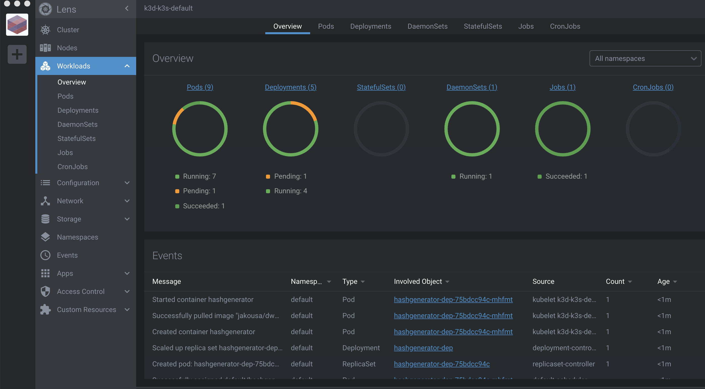
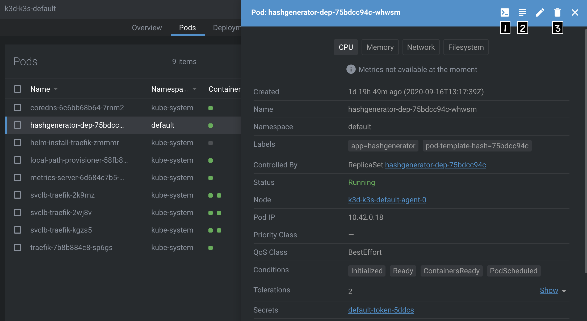

<text-box variant='learningObjectives' name='Learning Objectives'>

After this section you

- can start debugging when something doesn't work

- know to use Lens to explore Kubernetes resources

</text-box>

Kubernetes is a "self-healing" system, and we'll get back to what Kubernetes consists of and how it actually works in part 5. But at this stage "self-healing" is an excellent concept: usually, you (the maintainer or the developer) don't have to do anything in case something goes wrong with a pod or a container.

Sometimes you need to interfere, or you might have problems with your own configuration. As you are trying to find bugs in your configuration start by eliminating all possibilities one by one. The key is to be systematic and **to question everything**. Here are the preliminary tools to solve problems.

The first is `kubectl describe` which can tell you most of everything you need to know about any resource.

The second is `kubectl logs` with which you can follow the logs of your possibly broken software.

The third is `kubectl delete` which will simply delete the resource and in some cases, like with pods in deployment, a new one will be automatically released.

Finally, we have the overarching tool [Lens "The Kubernetes IDE"](https://k8slens.dev/), which you should start using right now to familiarize yourself with the usage.

During exercises you also have our Discord channel available (to which you joined in [part 0](/part-0)).

Let's test these tools and experiment using Lens. You will likely face a real debugging challenge during the exercises and there is another preplanned one in part 5 when we have a larger set of moving parts available to us.

Let's deploy the application and see what's going on.

```console
$ kubectl apply -f https://raw.githubusercontent.com/kubernetes-hy/material-example/master/app1/manifests/deployment.yaml
  deployment.apps/hashgenerator-dep created

$ kubectl describe deployment hashgenerator-dep
  Name:                   hashgenerator-dep
  Namespace:              default
  CreationTimestamp:      Fri, 05 Apr 2024 10:42:30 +0300
  Labels:                 <none>
  Annotations:            deployment.kubernetes.io/revision: 1
  Selector:               app=hashgenerator
  Replicas:               1 desired | 1 updated | 1 total | 1 available | 0 unavailable
  StrategyType:           RollingUpdate
  MinReadySeconds:        0
  RollingUpdateStrategy:  25% max unavailable, 25% max surge
  Pod Template:
    Labels:  app=hashgenerator
    Containers:
     hashgenerator:
      Image:        jakousa/dwk-app1:b7fc18de2376da80ff0cfc72cf581a9f94d10e64
      Port:         <none>
      Host Port:    <none>
      Environment:  <none>
      Mounts:       <none>
    Volumes:        <none>
  Conditions:
    Type           Status  Reason
    ----           ------  ------
    Available      True    MinimumReplicasAvailable
    Progressing    True    NewReplicaSetAvailable
  OldReplicaSets:  <none>
  NewReplicaSet:   hashgenerator-dep-75bdcc94c (1/1 replicas created)
  Events:
    Type    Reason             Age    From                   Message
    ----    ------             ----   ----                   -------
    Normal  ScalingReplicaSet  8m39s  deployment-controller  Scaled up replica set hashgenerator-dep-75bdcc94c to 1
```

There's a lot of information we are not ready to evaluate yet. Take a moment to read through everything. There're at least a few key information pieces we know, mostly because we defined them earlier in the yaml. The _Events_ is quite often the place to look for errors.

The command `describe` can be used for other resources as well. Let's see the pod next:

```console
$ kubectl describe pod hashgenerator-dep-75bdcc94c-whwsm
  ...
  Events:
    Type    Reason     Age   From                              Message
    ----    ------     ----  ----                              -------
    Normal  Scheduled  26s   default-scheduler  Successfully assigned default/hashgenerator-dep-7877df98df-qmck9 to k3d-k3s-default-server-0
    Normal  Pulling    15m   kubelet            Pulling image "jakousa/dwk-app1:b7fc18de2376da80ff0cfc72cf581a9f94d10e64"
    Normal  Pulled     26s   kubelet            Container image "jakousa/dwk-app1:b7fc18de2376da80ff0cfc72cf581a9f94d10e64"
    Normal  Created    26s   kubelet            Created container hashgenerator
    Normal  Started    26s   kubelet            Started container hashgenerator
```

There's again a lot of information but let's focus on the events this time. Here we can see everything that happened. Scheduler successfully pulled the image and started the container in node called "k3d-k3s-default-server-0". Everything is working as intended, excellent. The application is running.

Next, let's check that the application is actually doing what it should by reading the logs.

```console
$ kubectl logs hashgenerator-dep-75bdcc94c-whwsm
  jst944
  3c2xas
  s6ufaj
  cq7ka6
```

Everything seems to be in order. However, wouldn't it be great if there was a dashboard to see everything going on? Let's see what the Lens can do.

First, you'll need to add the cluster to Lens. If the config is not available in the dropdown you can get the kubeconfig for custom with `kubectl config view --minify --raw`. After you've added the cluster, open Workloads/Overview tab. A view similar to the following should open up



At the bottom, we can see every event, and at the top, we can see the status of different resources in our cluster. Try deleting and reapplying the deployment and you should see events in the dashboard. This is the same output that you would see from `kubectl get events`

Next, let's navigate to the tab Workloads/Pods and click our pod with the name "hashgenerator-dep-...".



The view shows us the same information as was in the description. But the GUI offers us actions as well. The three icons numbered in the top right corner are:

1. Open terminal into a container in the pod
2. Show logs
3. Delete the resource

"Why do I use Lens? If you use kubectl from the terminal, for example, to list the pods, there are no guarantees that the pods will still be there when you issue the next kubectl command. In contrast, with Lens, you have a graphical representation of everything, and it all updates live, so you can see when pods or any other objects disappear or any other changes happen." - [Matti Paksula](http://github.com/matti)
