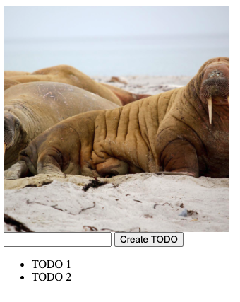

<text-box variant='learningObjectives' name='Learning Objectives'>

After this section you

- are able to use volumes to share data between two containers in a pod

- know about persistent volumes to store data on the disk of a node

</text-box>

There are two things that are known to be difficult with Kubernetes. First is networking. Thankfully we can avoid most of the networking difficulties unless we were going to setup our own cluster. If you're interested you can watch this Webinar on "[Kubernetes and Networks: Why is This So Dang Hard?](https://www.youtube.com/watch?v=GgCA2USI5iQ)" but we'll skip most of the topics discussed in the video. The other of the most difficult things is **storage**.

In part 1 we will look into a very basic method of using storage and return to this topic later. Where almost everything else in Kubernetes is very much dynamic, moving between nodes and replicating with ease, storage does not have the same possibilities. "[Why Is Storage On Kubernetes So Hard?](https://softwareengineeringdaily.com/2019/01/11/why-is-storage-on-kubernetes-is-so-hard/)" provides us a wide angle on the difficulties and the different options we have to overcome them.

There are multiple types of volumes and we'll get started with two of them.

### Volumes ###

A [volume](https://docs.docker.com/storage/volumes/) in Docker and Docker compose is the way to persist the data the containers are using. With Kubernetes [the simple volumes](https://kubernetes.io/docs/concepts/storage/ephemeral-volumes/) that is not quite the case.

The Kubernetes volumes, in technical terms *emptyDir* volumes, are shared filesystems _inside a pod_, this means that their lifecycle is tied to a pod. When the pod is destroyed the data is lost. In addition, simply moving the pod from another node will destroy the contents of the volume as the space is reserved from the node the pod is running on. So surely you should not use [emptyDir](https://kubernetes.io/docs/concepts/storage/volumes/#emptydir) volumes e.g. for backing up a database. Even with the limitations it may be used as a cache as it persists between container restarts or it can be used to share files between two containers in a pod.

Before we can get started with this, we need an application that shares data with another application. In this case, it will work as a method to share simple log files with each other. We'll need to develop:
- App 1 that will check if /usr/src/app/files/image.jpg exists and if not, it downloads a random image and saves it as image.jpg. Any HTTP request will trigger a new image generation.
- App 2 that will check for the file /usr/src/app/files/image.jpg and shows it, if it is available.

Apps share a deployment so that both of them are **inside the same pod**. My version is available for you to use [here](https://github.com/kubernetes-hy/material-example/blob/b9ff709b4af7ca13643635e07df7367b54f5c575/app3/manifests/deployment.yaml). The example includes an ingress and a service to access the application.

**deployment.yaml**

```yaml
apiVersion: apps/v1
kind: Deployment
metadata:
  name: images-dep
spec:
  replicas: 1
  selector:
    matchLabels:
      app: images
  template:
    metadata:
      labels:
        app: images
    spec:
      volumes: # Define volume
        - name: shared-image
          emptyDir: {}
      containers:
        - name: image-finder
          image: jakousa/dwk-app3-image-finder:b7fc18de2376da80ff0cfc72cf581a9f94d10e64
          volumeMounts: # Mount volume
          - name: shared-image
            mountPath: /usr/src/app/files
        - name: image-response
          image: jakousa/dwk-app3-image-response:b7fc18de2376da80ff0cfc72cf581a9f94d10e64
          volumeMounts: # Mount volume
          - name: shared-image
            mountPath: /usr/src/app/files
```

As the display is dependent on the volume we can confirm that it works by accessing the image-response and getting the image. The provided ingress used the previously opened port 8081 <http://localhost:8081>

Note that all data is lost when the pod goes down.

<exercise name='Exercise 1.10: Even more services'>

  Split the "Log output" application into two different containers within a single pod:

  One generates a new timestamp every 5 seconds and saves it into a file.

  The other reads that file and outputs it with a hash for the user to see.

  Either application can generate the hash. The reader or the writer.

  You may find [this](https://kubernetes.io/docs/reference/kubectl/generated/kubectl_logs/) helpful now since there are more than one container running inside a pod.

</exercise>

### Persistent Volumes ###

In contrast to the emptyDir volumes, a [Persistent Volume](https://kubernetes.io/docs/concepts/storage/persistent-volumes/) is something you probably had in mind when we started talking about volumes.

A Persistent Volume (PV) is a cluster-wide resource, that represents a piece of storage in the cluster that has been provisioned by the cluster administrator or is [dynamically](https://kubernetes.io/docs/concepts/storage/dynamic-provisioning/) provisioned. Persistent Volumes can be backed by various types of storage such as local disk, NFS, cloud storage, etc.

PVs have a lifecycle independent of any individual pod that uses the PV. This means that the data in the PV can outlive the pod that it was attached to.

When using a cloud provider, such as Google Kubernetes Engine which we shall use in parts 3 and 4, it is the cloud provider that takes care of backing storage and the Persistent Volumes that you can use. If you run your own cluster or use a local cluster such as k3s for development, you need to take care of the storage system and Persistent Volumes by yourself.

An easy option that we can use with K3s is a [local](https://kubernetes.io/docs/concepts/storage/volumes/#local) PersistentVolume that uses a path in a cluster node as the storage. This solution ties the volume to a particular node and if the node becomes unavailable, the storage is not usable.

So the local Persistent Volumes are **not** the solution to be used in production!

For the _PersistentVolume_ to work you first need to create the local path in the node we are binding it to. Since our cluster runs via Docker let's create a directory at `/tmp/kube` in the container `k3d-k3s-default-agent-0`. This can simply be done via `docker exec k3d-k3s-default-agent-0 mkdir -p /tmp/kube`

The Persistent Volume definition is created as follows:

**persistentvolume.yaml**

```yaml
apiVersion: v1
kind: PersistentVolume
metadata:
  name: example-pv
spec:
  storageClassName: my-example-pv # this is the name you are using later to claim this volume
  capacity:
    storage: 1Gi # Could be e.q. 500Gi. Small amount is to preserve space when testing locally
  volumeMode: Filesystem # This declares that it will be mounted into pods as a directory
  accessModes:
  - ReadWriteOnce
  local:
    path: /tmp/kube
  nodeAffinity: ## This is only required for local, it defines which nodes can access it
    required:
      nodeSelectorTerms:
      - matchExpressions:
        - key: kubernetes.io/hostname
          operator: In
          values:
          - k3d-k3s-default-agent-0
```

[Persistent Volume Claim](https://kubernetes.io/docs/concepts/storage/persistent-volumes/) (PVC) is a request for storage by a user.

When a user creates a PVC, Kubernetes finds an appropriate PV that satisfies the claim's requirements and binds them together. If no PV is available, depending on the configuration, the cluster might dynamically create a PV that meets the claim's needs.

Once bound, the PersistentVolumeClaim is "locked" and can only be used by one Pod (depending on the access mode specified). This ensures that the PV resource is exclusively used by the pod it's bound to.

If there is no suitable Persistent Volume available, the PVC will stay in the "Pending" state, waiting for a suitable PV.

Conceptually, you can think of PVs as the physical volume (the actual storage in your infrastructure), whereas PVCs are the means by which pods claim this storage for their use.

Let us now create a claim for our app:

**persistentvolumeclaim.yaml**

```yaml
apiVersion: v1
kind: PersistentVolumeClaim
metadata:
  name: image-claim # name of ther volume claim, this will be used in the deployment
spec:
  storageClassName: my-example-pv # this is the name of the persisten volume we are claiming
  accessModes:
    - ReadWriteOnce
  resources:
    requests:
      storage: 1Gi
```

Modify the previously introduced deployment to use it:

**deployment.yaml**
```yaml
# ...
    spec:
      volumes:
        - name: shared-image
          persistentVolumeClaim:
            claimName: image-claim
      containers:
        - name: image-finder
          image: jakousa/dwk-app3-image-finder:b7fc18de2376da80ff0cfc72cf581a9f94d10e64
          volumeMounts:
          - name: shared-image
            mountPath: /usr/src/app/files
        - name: image-response
          image: jakousa/dwk-app3-image-response:b7fc18de2376da80ff0cfc72cf581a9f94d10e64
          volumeMounts:
          - name: shared-image
            mountPath: /usr/src/app/files
```

And apply it with persistentvolume.yaml and persistentvolumeclaim.yaml.

```console
$ kubectl apply -f https://raw.githubusercontent.com/kubernetes-hy/material-example/master/app3/manifests/deployment-persistent.yaml
```

With the previous service and ingress, we can access the app in http://localhost:8081. To confirm that the data is persistent we can run

```console
$ kubectl delete -f https://raw.githubusercontent.com/kubernetes-hy/material-example/master/app3/manifests/deployment-persistent.yaml
  deployment.apps "images-dep" deleted
$ kubectl apply -f https://raw.githubusercontent.com/kubernetes-hy/material-example/master/app3/manifests/deployment-persistent.yaml
  deployment.apps/images-dep created
```

The same file is available again!

If you are interested in learning more about running your own storage you can check out eg. the following:

* [Rook](https://rook.io/)

* [OpenEBS](https://openebs.io/)

* [StorageOS](https://storageos.com/)

* [Longhorn](https://longhorn.io/)

<exercise name='Exercise 1.11: Persisting data'>

  Let's share data between "Ping-pong" and "Log output" applications using persistent volumes. Create both a *PersistentVolume* and *PersistentVolumeClaim* and alter the *Deployment* to utilize it. As PersistentVolumes are often maintained by cluster administrators rather than developers and those are not application specific you should keep the definition for those separated, perhaps in own folder.

  Save the number of requests to "Ping-pong" application into a file in the volume and output it with the timestamp and hash when sending a request to our "Log output" application. In the end, the two pods should share a persistent volume between the two applications. So the browser should display the following when accessing the "Log output" application:

  ```plaintext
  2020-03-30T12:15:17.705Z: 8523ecb1-c716-4cb6-a044-b9e83bb98e43.
  Ping / Pongs: 3
  ```

</exercise>

<exercise name='Exercise 1.12: Project v0.6'>

  Since the project looks really boring right now, let's add a picture!

  The goal is to add a daily image to the project. And every day a new image is fetched on the first request.

  Get a random picture from Lorem Picsum like `https://picsum.photos/1200` and display it in the project. Find a way to store the image so it stays the same for 60 minutes.

  Make sure to cache the image into a volume so that the API isn't needed for new images every time we access the application or the container crashes.

  The best way to test what happens when your container shuts down is likely by shutting down the container, so you can add logic for that as well, for testing purposes.

</exercise>

<exercise name='Exercise 1.13: Project v0.7'>

  For the project, we'll need to do some coding to start seeing results in the next part.

  1. Add an input field. The input should not take todos that are over 140 characters long.

  2. Add a send button. It does not have to send the todo yet.

  3. Add a list of the existing todos with some hardcoded todos.

  Maybe something similar to this:
  

</exercise>
