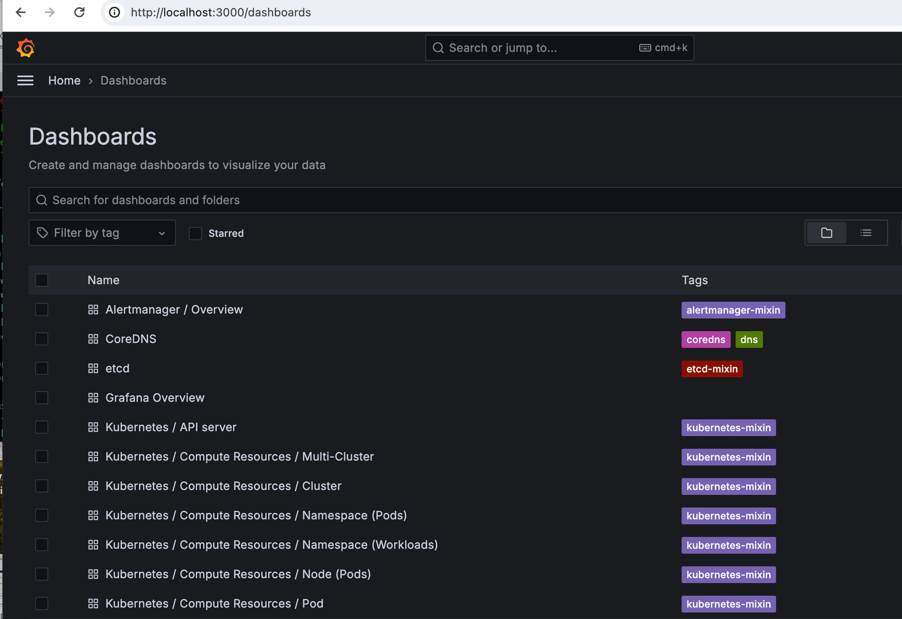
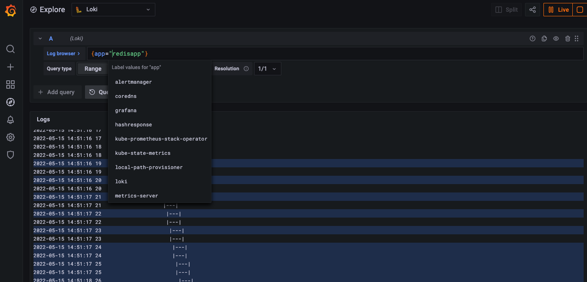

<text-box variant='learningObjectives' name='Learning Objectives'>

After this section you

- know of the wide array of tools used for monitoring and can implement simple logging

- know about CRDs or Custom Resource Definitions

- know about Helm, the package manager for Kubernetes

</text-box>

Our cluster and the apps in it have so far been pretty much a black box for us. We've thrown stuff in and then hoped that everything works all right. We're now going to use [Prometheus](https://prometheus.io/) to monitor the cluster and [Grafana](https://grafana.com/) to view the data.

Before we can get started let's look into how Kubernetes applications are managed more easily. [Helm](https://helm.sh/) uses a packaging format called _charts_ to define the dependencies of an application. Among other things, Helm Charts include information for the version of the chart, the requirements of the application such as the Kubernetes version as well as other charts that it may depend on.

Installation instructions for Helm are found [here](https://helm.sh/docs/intro/install/).

After the installation, we can add the official charts repository:

```console
$ helm repo add prometheus-community https://prometheus-community.github.io/helm-charts
$ helm repo add stable https://charts.helm.sh/stable
```

Next, we can install the [kube-prometheus-stack](https://artifacthub.io/packages/helm/prometheus-community/kube-prometheus-stack). By default, this would put everything in the default namespace. Let's create a new namespace and add it there.

```console
$ kubectl create namespace prometheus
$ helm install prometheus-community/kube-prometheus-stack --generate-name --namespace prometheus
...
NAME: kube-prometheus-stack-1635945330
LAST DEPLOYED: Wed Nov  3 15:15:37 2021
NAMESPACE: prometheus
STATUS: deployed
REVISION: 1
NOTES:
kube-prometheus-stack has been installed. Check its status by running:
  kubectl --namespace prometheus get pods -l "release=kube-prometheus-stack-1635945330"
```

This added a lot of stuff to our cluster. Among other things, it added a number of [custom resources](https://kubernetes.io/docs/concepts/extend-kubernetes/api-extension/custom-resources/). They are a way to extend the Kubernetes APIs to offer new resources that Kubernetes doesn't support out of the box. We will be designing our own custom resources in [part 5](https://devopswithkubernetes.com/part5/).

You can remove almost everything with `helm delete [name]` with the name found using the command `helm list -n prometheus`. Custom resource definitions are left and have to be manually removed if the need arises. The definitions don't do anything by themselves so leaving them does no harm.

Let us open a way into Grafana so we can see the data.

```console
$ kubectl get po -n prometheus
 NAME                                                              READY   STATUS    RESTARTS   AGE
 kube-prometheus-stack-1602180058-prometheus-node-exporter-nt8cp   1/1     Running   0          53s
 kube-prometheus-stack-1602180058-prometheus-node-exporter-ft7dg   1/1     Running   0          53s
 kube-prometheus-stack-1602-operator-557c9c4f5-wbsqc               2/2     Running   0          53s
 kube-prometheus-stack-1602180058-prometheus-node-exporter-tr7ns   1/1     Running   0          53s
 kube-prometheus-stack-1602180058-kube-state-metrics-55dccdkkz6w   1/1     Running   0          53s
 alertmanager-kube-prometheus-stack-1602-alertmanager-0            2/2     Running   0          35s
 kube-prometheus-stack-1602180058-grafana-59cd48d794-4459m         2/2     Running   0          53s
 prometheus-kube-prometheus-stack-1602-prometheus-0                3/3     Running   1          23s

$ kubectl -n prometheus port-forward kube-prometheus-stack-1602180058-grafana-59cd48d794-4459m 3000
  Forwarding from 127.0.0.1:3000 -> 3000
  Forwarding from [::1]:3000 -> 3000
```

Access [http://localhost:3000](http://localhost:3000) with browser and use the credentials admin / prom-operator. At the top left you can browse different dashboards:



The dashboards show already lots of interesting information about the cluster but we'd really like to know more about the apps we're running as well. Let's add [Loki](https://grafana.com/oss/loki/) so that we can see logs.

To confirm that everything works we should have an application that'll output something to stdout. Let's run the Redis application from previously by applying [this](https://raw.githubusercontent.com/kubernetes-hy/material-example/master/app5/manifests/statefulset.yaml). We can keep it running as it'll generate a good amount of log output for us.

The [Loki-stack Chart](https://github.com/grafana/helm-charts/tree/main/charts/loki-stack) includes everything we need:

```console
$ helm repo add grafana https://grafana.github.io/helm-charts
$ helm repo update
$ kubectl create namespace loki-stack
  namespace/loki-stack created

$ helm upgrade --install loki --namespace=loki-stack grafana/loki-stack

$ kubectl get all -n loki-stack
  NAME                      READY   STATUS    RESTARTS   AGE
  pod/loki-promtail-n2fgs   1/1     Running   0          18m
  pod/loki-promtail-h6xq2   1/1     Running   0          18m
  pod/loki-promtail-8l84g   1/1     Running   0          18m
  pod/loki-0                1/1     Running   0          18m

  NAME                    TYPE        CLUSTER-IP     EXTERNAL-IP   PORT(S)    AGE
  service/loki            ClusterIP   10.43.170.68   <none>        3100/TCP   18m
  service/loki-headless   ClusterIP   None           <none>        3100/TCP   18m

  NAME                           DESIRED   CURRENT   READY   UP-TO-DATE   AVAILABLE   NODE SELECTOR   AGE
  daemonset.apps/loki-promtail   3         3         3       3            3           <none>          18m

  NAME                    READY   AGE
  statefulset.apps/loki   1/1     18m
```

Here we see that Loki is running in port 3100. As an additional bonus, because we installed the loki-stack we've got [Promtail](https://grafana.com/docs/loki/latest/clients/promtail/), which makes it trivial for us to send logs from our applications to Loki. So trivial in fact, that we don't have to do anything except configure Grafana to show Loki.

Open Grafana, go to settings, and choose _Connections_, _Data Sources_, and then _Add data source_. Choose Loki and then insert the correct URL. From the output above we can guess that the port should be 3100, the namespace is loki-stack and the name of the service is loki. So the answer would be http://loki.loki-stack:3100. No other fields need to be changed.

Now we can use the Explore tab (compass) to explore the data.



<exercise name='Exercise 2.10: Project v1.3'>

  The project could really use logging.

  Add request logging so that you can monitor every _todo_ that is sent to the backend.

  Set the limit of 140 characters for todos into the backend as well. Use Postman or curl to test that too long todos are blocked by the backend and you can see the non-allowed messages in your Grafana.

</exercise>

### The easy way out ###

There was an easier way for us to install Prometheus with a few clicks. If you have to install it again you can try this:

1. Open [Lens](https://k8slens.dev/)
2. Right click the cluster icon in the top left and choose "Settings"
3. Scroll down and under "Features" under "Metrics" you can press "Install"

A great option especially for your local cluster or hobby cluster.
