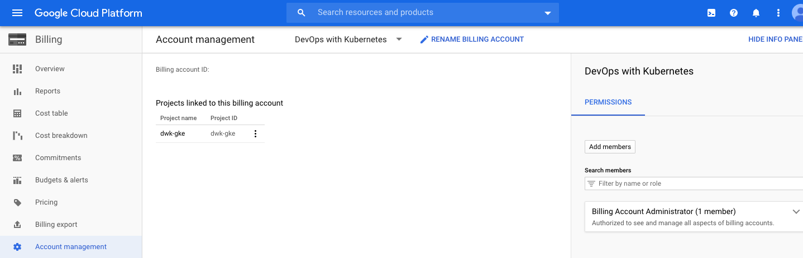

<text-box variant='learningObjectives' name='Learning Objectives'>

After this section you can

- Create your own cluster in GKE

- Deploy applications to Google Kubernetes Engine

</text-box>

We have used Kubernetes distribution k3s using docker containers via k3d. In a production environment the task of maintaining a Kubernetes cluster is often left to third parties. A managed Kubernetes as a service is often the best choice as the additional work required in maintenance exceeds the benefits of a personal cluster. In some, somewhat rare, cases setting up and maintaining your own cluster is a reasonable option. A case for it would be that your company/organization already has the hardware and/or wants to stay independent from providers, one such example could be a University. Another primary reason for operating your own Kubernetes cluster is that regulations rule out all other choices.

Even in Kubernetes then the cost for running software that is rarely used may be higher than the value it generates. In such cases using [Serverless](https://en.wikipedia.org/wiki/Serverless_computing) solutions could be more cost-efficient. Kubernetes can get really expensive really fast.

<!---
<text-box variant='hint' name='Registration for Open University students'>
  If you are student in Finland, a student with finnish social security number or a student at the University of Helsinki register for the course now. Follow the <a href="/registration-and-completion">instructions</a> to receive Google Cloud Platform Education Grant.
</text-box>
-->

Let's focus on the Google Kubernetes Engine (GKE) costs for now. Note that the GKE costs a little bit more than its competitors.

The calculator here [https://cloud.google.com/products/calculator](https://cloud.google.com/products/calculator) offers us a picture of the pricing. I decided to try a cheap option: 6 nodes in 1 zonal cluster using 1 vCPU each. The datacenter location is in Finland and I don't need a persistent disk. If we wanted less than 6 nodes why would we even use Kubernetes? The total cost for this example was ~145€ / ~$160 per month. Adding additional services such as a Load balancer increase the cost. If you find the billing for Google Cloud Platform confusing, you're not alone: Coursera has ~5 hour course for "[Understanding Your Google Cloud Platform Costs](https://www.coursera.org/learn/gcp-cost-management)".

During part 3 we will be using GKE either by using the student credits available to students with helsinki.fi email or the free credits offered by Google. You are responsible for making sure that the credits last for the whole part and if all of them are consumed I can not help you.

After redeeming the credits we can create a project with the billing account. The Google Cloud UI can be confusing. On the [resources page](https://console.cloud.google.com/cloud-resource-manager) we can create a new project and let's name it "dwk-gke" for the purposes of this course. After creating this project make sure that the project is linked to the correct billing account from the top-left dropdown and billing and then "Account Management". It should look like this (In this case the account is "DevOps with Kubernetes" and project "dwk-gke"):



Install the Google Cloud SDK. Instructions [here](https://cloud.google.com/sdk/install). After that login and set the previously created project to be used.

```console
$ gcloud -v
  Google Cloud SDK 363.0.0
  bq 2.0.71
  core 2021.10.29
  gsutil 5.4

$ gcloud auth login
  ...
  You are now logged in

$ gcloud config set project dwk-gke
  Updated property [core/project].
```

We can now create a cluster. You can choose any zone we want from the list [here](https://cloud.google.com/about/locations/). I chose Finland. Notice that one region (e.g. europe-north1) may have multiple regions (e.g. -a). Let's add a few more flags: `--release-channel=rapid --cluster-version=1.22`. These will ask GKE to use a version that will be default in December 2021. If it's already December or 2022 you can test that it works without the flags and throw a PR into the material!

```console
$ gcloud container clusters create dwk-cluster --zone=europe-north1-b --release-channel=rapid --cluster-version=1.22
ERROR: (gcloud.container.clusters.create) ResponseError: code=400, message=Failed precondition when calling the ServiceConsumerManager: tenantmanager:: Consumer should enable service:container.googleapis.com before generating a service account.
```

Let's enable the service in question, `container.googleapis.com`, before retrying.

```console
$ gcloud services enable container.googleapis.com
  Operation "operations/acf.p2-385245615727-2f855eed-e785-49ac-91da-896925a691ab" finished successfully.

$ gcloud container clusters create dwk-cluster --zone=europe-north1-b --release-channel=rapid --cluster-version=1.22
  ...
  Creating cluster dwk-cluster in europe-north1-b...
  ...
  kubeconfig entry generated for dwk-cluster.
  NAME         LOCATION         MASTER_VERSION   MASTER_IP      MACHINE_TYPE  NODE_VERSION     NUM_NODES  STATUS
  dwk-cluster  europe-north1-b  1.22.2-gke.1901  35.228.152.81  e2-medium     1.22.2-gke.1901  3          RUNNING
```

It set the kubeconfig to point in the right direction already. But if you need to do it again we can set the kubeconfig like this:

```console
$ gcloud container clusters get-credentials dwk-cluster --zone=europe-north1-b
  Fetching cluster endpoint and auth data.
  kubeconfig entry generated for dwk-cluster.
```

You can check the cluster info with `kubectl cluster-info` to verify it's pointing in the right direction.

### Deploying to GKE ###

The cluster we have now is *almost* like the one we had locally. Let's apply this application that creates a random string and then serves an image based on that random string. This will create 6 replicas of the process "seedimage".

```console
$ kubectl apply -f https://raw.githubusercontent.com/kubernetes-hy/material-example/e11a700350aede132b62d3b5fd63c05d6b976394/app6/manifests/deployment.yaml
```

Exposing the service is where the differences start. Instead of an ingress we'll use *LoadBalancer* service. Now as a warning the next step is going to add into the [cost of the cluster](https://cloud.google.com/compute/all-pricing#lb) as well.

Apply the following:

**service.yaml**

```yaml
apiVersion: v1
kind: Service
metadata:
  name: seedimage-svc
spec:
  type: LoadBalancer # This should be the only unfamiliar part
  selector:
    app: seedimage
  ports:
    - port: 80
      protocol: TCP
      targetPort: 3000
```

A load balancer service asks for Google services to provision us a load balancer. We can wait until the service gets an external IP:

```console
$ kubectl get svc --watch
  NAME            TYPE           CLUSTER-IP      EXTERNAL-IP    PORT(S)        AGE
  kubernetes      ClusterIP      10.31.240.1     <none>         443/TCP        144m
  seedimage-svc   LoadBalancer   10.31.241.224   35.228.41.16   80:30215/TCP   94s
```

If we now access http://35.228.41.16 with our browser we'll see the application up and running. By refreshing the page we can also see that the load balancer sometimes offers us a different image.

<div class="highlight-box" markdown="1">
To avoid using up the credits delete the cluster whenever you do not need it

```console
$ gcloud container clusters delete dwk-cluster --zone=europe-north1-b
```

And when resuming progress create the cluster back.
```console
$ gcloud container clusters create dwk-cluster --zone=europe-north1-b --release-channel=rapid --cluster-version=1.22
```

Closing the cluster will also remove everything you've deployed on the cluster. If you decide to take a break during an example you may have to redo it. Thankfully we have used a declarative approach so continuing progress will only require you to apply the yamls.
</exercise>

### Persisting data in GKE ###

Google Kubernetes Engine will automatically provision a persistent disk for your PersistentVolumeClaim - just don't set the storage class. If you want you can read more about it [here](https://cloud.google.com/kubernetes-engine/docs/concepts/persistent-volumes).

<exercise name='Exercise 3.01: Pingpong GKE'>

  Deploy ping / pong application into GKE.

  In this exercise use a LoadBalancer service to expose the service.

  If your postgres logs say

  ```console
initdb: error: directory "/var/lib/postgresql/data" exists but is not empty
It contains a lost+found directory, perhaps due to it being a mount point.
Using a mount point directly as the data directory is not recommended.
Create a subdirectory under the mount point.
  ```

  you can add subPath configuration:

  **statefulset.yaml**
  ```yaml
...
  volumeMounts:
  - name: data
    mountPath: /var/lib/postgresql/data
    subPath: postgres
...
  ```

  This will create a postgres directory where the data will reside. subPaths also make it possible to use single volume for multiple purposes.

</exercise>

### From Service to Ingress ###

Services are quite simple. Let's try using ingress since it offers us additional tools in exchange for complexity.

*NodePort* type service is required with an Ingress in GKE. Even though it is NodePort, GKE does not expose it outside the cluster. Let's test this by continuing with the previous example.

**service.yaml**

```yaml
apiVersion: v1
kind: Service
metadata:
  name: seedimage-svc
spec:
  type: NodePort
  selector:
    app: seedimage
  ports:
    - port: 80
      protocol: TCP
      targetPort: 3000
```

**ingress.yaml**

```yaml
apiVersion: networking.k8s.io/v1
kind: Ingress
metadata:
  name: seedimage-ing
spec:
  rules:
  - http:
      paths:
      - path: /
        pathType: Prefix
        backend:
          service:
            name: seedimage-svc
            port:
              number: 80
```

When you have applied those you can view the port from the list of ingresses:

```
$ kubectl get ing
  NAME            CLASS    HOSTS   ADDRESS         PORTS   AGE
  seedimage-ing   <none>   *       34.120.61.234   80      2m13s
```

Now the address here will be the way to access the application. This will take a moment to deploy, responses may be 404 and 502 as it becomes available. The Ingress performs health checks by GET requesting / and expects an HTTP 200 response.

<exercise name='Exercise 3.02: Back to Ingress'>

  Deploy the "Log output" and "Ping-pong" applications into GKE and expose it with Ingress.

  "Ping-pong" will have to respond from /pingpong path. This may require you to rewrite parts of the code.

</exercise>

<quiz id="419b91fc-769c-4964-b679-e7790f70799b"></quiz>
