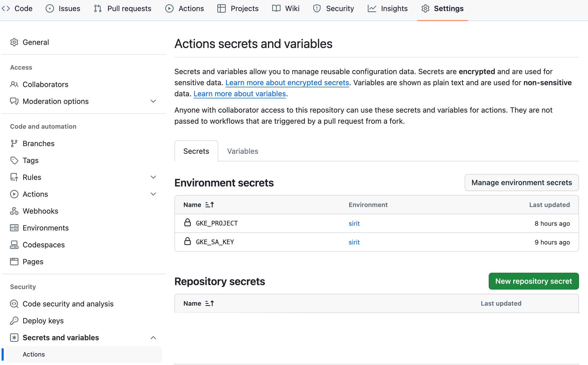

<text-box variant='learningObjectives' name='Learning Objectives'>

After this section you can

- Create your own deployment pipeline to GKE with Github Actions and enable continuous delivery from a git push to production

</text-box>

Let's setup a deployment pipeline using GitHub actions. We just need something to deploy so let's create a new website.

Create a Dockerfile with the following contents:

```Dockerfile
FROM nginx:1.19-alpine

COPY index.html /usr/share/nginx/html
```

and add index.html with the following content

```html
<!DOCTYPE html>
<html>
  <body style="background-color: gray;">
    <p>
      Content
    </p>
  </body>
</html>
```

Let's make sure that everything works by doing `docker build . -t colorcontent && docker run -p 3000:80 colorcontent` to build and run it and then accessing it through [http://localhost:3000](http://localhost:3000). Next is the addition of manifests for our website.

**manifests/service.yaml**

```yaml
apiVersion: v1
kind: Service
metadata:
  name: dwk-environments-svc
spec:
  type: LoadBalancer
  selector:
    app: dwk-environments
  ports:
    - port: 80
      protocol: TCP
      targetPort: 80
```

**manifests/deployment.yaml**

```yaml
apiVersion: apps/v1
kind: Deployment
metadata:
  name: dwk-environments
spec:
  replicas: 1
  selector:
    matchLabels:
      app: dwk-environments
  template:
    metadata:
      labels:
        app: dwk-environments
    spec:
      containers:
        - name: dwk-environments
          image: jakousa/colorcontent
```

Next, to test our manifests deploy this into our cluster. Above I had pushed the built image using `docker push`.

```console
$ kubectl apply -f manifests/service.yaml
$ kubectl apply -f manifests/deployment.yaml
```

### Kustomize

Applying multiple files like this gets bothersome. We can of course point it at a directory like so: `kubectl apply -f manifests/`, but this is an excellent moment to turn our attention to Kustomize.

[Kustomize](https://github.com/kubernetes-sigs/kustomize) is a tool that helps with configuration customization and is baked into kubectl. In this case we'll use it to define which files are meaningful for Kubernetes. Alternatively, we could use Helm and maybe [Helmsman](https://github.com/Praqma/helmsman), but we will leave that outside of the context of this course.

For us a new file _kustomization.yaml_ in the root of the project will work. The _kustomization.yaml_ should include instructions to use the deployment.yaml and service.yaml.

**kustomization.yaml**

```yaml
apiVersion: kustomize.config.k8s.io/v1beta1
kind: Kustomization
resources:
  - manifests/deployment.yaml
  - manifests/service.yaml
```

Now we can deploy this using the `-k` flag identifying that we want to use Kustomize.

```console
$ kubectl apply -k .
```

We can preview the file with `kubectl kustomize .`. Kustomize will be an essential tool for our deployment pipeline. It'll allow us to individually choose which image to use. For this let's declare the image inside the kustomization.yaml.

**kustomization.yaml**

```yaml
# ...
images:
  - name: PROJECT/IMAGE
    newName: jakousa/colorcontent
```

This will replace the image "IMAGE:TAG" with the one defined in _newName_. Next setting a placeholder value inside the deployment.yaml for the image:

**deployment.yaml**

```yaml
# ...
containers:
  - name: dwk-environments
    image: PROJECT/IMAGE
```

Test that everything works

```console
$ kubectl kustomize .
  ...
    spec:
      containers:
      - image: jakousa/colorcontent
        name: dwk-environments
```

Kustomize has a few additional tools you can test out if you want to install it - but we'll see the usage in the next section.

### Github Actions

[GitHub Actions](https://github.com/features/actions) will be the CI/CD tool of choice for this course. Google also offers [Cloud Build](https://cloud.google.com/cloud-build), and a [step-by-step guide to deploying to GKE](https://cloud.google.com/cloud-build/docs/deploying-builds/deploy-gke) with it. You can return here to implement deployment with Cloud Build if you have credits left over after the course!

Create a file .github/workflows/main.yaml. We'll want the workflow to do 3 things:

- build the image
- publish the image to a container registry
- deploy the new image to our cluster

The initial config will look something like this:

**main.yaml**

```yaml
name: Release application

on:
  push:

env:
  PROJECT_ID: ${{ secrets.GKE_PROJECT }}
  GKE_CLUSTER: dwk-cluster
  GKE_ZONE: europe-north1-b
  IMAGE: dwk-environments
  SERVICE: dwk-environments
  BRANCH: ${{ github.ref_name }}
```

We set the workflow to run whenever changes are pushed to the repository and set the environment variables accordingly - we'll need them later on.

Next is adding the jobs. For simplicity, we'll add everything into a single job that'll build, publish and deploy.

```yaml
# ...
jobs:
  build-publish-deploy:
    name: Build, Publish and Deploy
    runs-on: ubuntu-latest

    steps:
      - name: Checkout
        uses: actions/checkout@v4
```

This sets the environment for the job and triggers the [checkout action](https://github.com/actions/checkout) as the first step.

Next we'll use some additional actions, mainly from [google-github-actions](https://github.com/google-github-actions) that are designed to help on deployments to Google Cloud. We'll start with [authenticaton](https://github.com/google-github-actions/auth), followed by [setup](https://github.com/google-github-actions/setup-gcloud):

```yaml
# ...
  - uses: google-github-actions/auth@v2
    with:
      credentials_json: '${{ secrets.GKE_SA_KEY }}'

  - name: 'Set up Cloud SDK'
    uses: google-github-actions/setup-gcloud@v2

  - name: 'Use gcloud CLI'
    run: gcloud info
```

The secrets used in authentication are **not** from the environment variables but are included as environment secrets in the project GitHub:



Read their [here](https://docs.github.com/en/actions/configuring-and-managing-workflows/creating-and-storing-encrypted-secrets) more on GitHub secrets.

The GKE\_SA\_KEY is a <i>service account key</i> that is required to access the Google Cloud services - read the guide for it [here](https://cloud.google.com/iam/docs/creating-managing-service-account-keys). You will need to create a new service account and fetch its key.

Give these roles to your service account:

- Kubernetes Engine Service Agent
- Storage Admin
- Artifact Registry Administrator
- Artifact Registry Create-on-Push Repository Administrator

After creating a service account for GKE called "github-actions" I created the key using gcloud:

```console
$ gcloud iam service-accounts keys create ./private-key.json --iam-account=github-actions@dwk-gke-331210.iam.gserviceaccount.com
```

The entire JSON generated needs to be added to GKE\_SA\_KEY.

Next, use _gcloud_ commands to configure Docker.

```yaml
# ...
  - run: gcloud --quiet auth configure-docker
```

This will enable us to push images to Google Container Registry, which we'll use instead of Docker Hub. We could use Docker Hub if we wanted to do so, but GCR is an excellent option now that we have access to it. GCR is a lot more performant and has a low network latency. Cutting down on the time we spend moving images around will ensure our deployments are quick. Read more about it here <https://cloud.google.com/container-registry/>. Note that the registry is [not free](https://cloud.google.com/container-registry/pricing) and you'll probably want to delete the images from there during and after this course.

One more step is needed until we are ready to go, we still need to use action
[get-gke-credentials](https://github.com/google-github-actions/get-gke-credentials) to get credentials to our Google Kubernetes cluster:

```yaml
# ...
  - name: 'Get GKE credentials'
    uses: 'google-github-actions/get-gke-credentials@v2'
    with:
      cluster_name: '${{ env.GKE_CLUSTER }}'
      project_id: '${{ env.PROJECT_ID }}'
      location: '${{ env.GKE_ZONE }}'
```

And finally let's write out the desired image with a tag. The image will be `gcr.io/PROJECT_ID/IMAGE:GITHUB_BRANCH-GITHUB_SHA`. And building the image:

```yaml
# ...
- name: Build
  run: docker build --tag "gcr.io/$PROJECT_ID/$IMAGE:$BRANCH-$GITHUB_SHA" .
```

We use the project name (from the env _$IMAGE_) as the image name and the tag is formed by concatenating the branch name, that comes from the env that we defined and the GitHub commit sha that is taken from env *$GITHUB_SHA* that is automatically provided by the workflow.

Publish similarily:

```yaml
# ...
- name: Publish
  run: docker push "gcr.io/$PROJECT_ID/$IMAGE:$BRANCH-$GITHUB_SHA"
```

Last step is the deployment. We'll setup Kustomize first:

```yaml
# ...
- name: Set up Kustomize
  uses: imranismail/setup-kustomize@v2.1
```

Now we can use Kustomize to set the image we want the pipeline to publish. Here I pipe the output of `kustomize build .` to `kubectl apply`, if you are unsure what is happening you can output the `kustomize build .` and check what was built in the middle of the pipeline!

Finally we'll preview the [rollout](https://kubernetes.io/docs/reference/kubectl/generated/kubectl_rollout/) and confirm that the release was a success. Rollout will wait until the deployment has rolled out. Here we use the same name of the image, dwk-environments, as the deployment name so we can use the \$IMAGE environment variable.

```yaml
# ...
- name: Deploy
  run: |-
    kustomize edit set image PROJECT/IMAGE=gcr.io/$PROJECT_ID/$IMAGE:$BRANCH-$GITHUB_SHA
    kustomize build . | kubectl apply -f -
    kubectl rollout status deployment $SERVICE
    kubectl get services -o wide
```

<exercise name='Exercise 3.03: Project v1.4'>

Setup automatic deployment for the project as well.

Hints:
- If your pod uses a Persistent Volume Claim access mode [ReadWriteOnce](https://kubernetes.io/docs/concepts/storage/persistent-volumes/#access-modes) you may need to consider the deployment [strategy](https://kubernetes.io/docs/concepts/workloads/controllers/deployment/#strategy) since the default (RollingUpdate) may cause problems. Read more from the [documentation](https://kubernetes.io/docs/concepts/workloads/controllers/deployment/#strategy). The other option is to use an [access mode](https://kubernetes.io/docs/concepts/storage/persistent-volumes/#access-modes) that allows many pods to mount the volume.
- If you are using Ingres, remember that it expects a service to give a successful response in the path / even if the service is mapped to some other path!

</exercise>

### Separate environment for each branch

A quite popular choice when using a deployment pipeline is having a separate environment for every branch - especially when using feature branching.

Let's implement our own version of this. Let's extend the previously defined pipeline. The current state of the pipeline looks as follows:

**main.yaml**

```yaml
name: Release application

on:
  push:

env:
  PROJECT_ID: ${{ secrets.GKE_PROJECT }}
  GKE_CLUSTER: dwk-cluster
  GKE_ZONE: europe-north1-b
  IMAGE: dwk-environments
  DEPLOYMENT: dwk-environments
  BRANCH: ${{ github.ref_name }}

jobs:
  build-publish-deploy:
    name: Build, Publish and Deploy
    runs-on: ubuntu-latest

    steps:
      - name: Checkout
        uses: actions/checkout@v4

      - uses: google-github-actions/auth@v2
        with:
          credentials_json: '${{ secrets.GKE_SA_KEY }}'

      - name: 'Set up Cloud SDK'
        uses: google-github-actions/setup-gcloud@v2

      - name: 'Use gcloud CLI'
        run: gcloud info

      - run: gcloud --quiet auth configure-docker

      - name: 'Get GKE credentials'
        uses: 'google-github-actions/get-gke-credentials@v2'
        with:
          cluster_name: '${{ env.GKE_CLUSTER }}'
          project_id: '${{ env.PROJECT_ID }}'
          location: '${{ env.GKE_ZONE }}'

      - name: Build and publish
        run: |-
          docker build --tag "gcr.io/$PROJECT_ID/$IMAGE:$BRANCH-$GITHUB_SHA" .
          docker push "gcr.io/$PROJECT_ID/$IMAGE:$BRANCH-$GITHUB_SHA"

      - name: Set up Kustomize
        uses: imranismail/setup-kustomize@v2

      - name: Deploy
        run: |-
          kustomize edit set image PROJECT/IMAGE=gcr.io/$PROJECT_ID/$IMAGE:$BRANCH-$GITHUB_SHA
          kustomize build . | kubectl apply -f -
          kubectl rollout status deployment $DEPLOYMENT
          kubectl get services -o wide
```

What we'll want to do is deploy each branch into a separate namespace so that each branch has its own separate environment.

The namespace can be changed with kustomize:


```console
kustomize edit set namespace ${GITHUB_REF#refs/heads/}
```

With this command, the namespace name will be equal to the branch name.

If the namespace is not defined, the command causes an error, so we need to create it:

```console
kubectl create namespace ${GITHUB_REF#refs/heads/} || true
```

We also need to take the namespace to use with command:

```console
kubectl config set-context --current --namespace=${GITHUB_REF#refs/heads/}
```

So the deploy step changes as follows:

```yaml
- name: Deploy
  run: |-
    kubectl create namespace ${GITHUB_REF#refs/heads/} || true
    kubectl config set-context --current --namespace=${GITHUB_REF#refs/heads/}
    kustomize edit set namespace ${GITHUB_REF#refs/heads/}
    kustomize edit set image PROJECT/IMAGE=gcr.io/$PROJECT_ID/$IMAGE:${GITHUB_REF#refs/heads/}-$GITHUB_SHA
    kustomize build . | kubectl apply -f -
    kubectl rollout status deployment $DEPLOYMENT
    kubectl get services -o wide
```

To test this, edit the index.html and publish the changes to a new branch.

The next step would be to configure the domain names for each branch so that we'd have "www.example.com" as the production and e.g. "feat_x.example.com" as the feat_x branch. If you have any credits left after the course you can return here and implement it. Google Cloud DNS and this [guide](https://cloud.google.com/kubernetes-engine/docs/tutorials/configuring-domain-name-static-ip) can get you started.

<exercise name='Exercise 3.04: Project v1.4.1'>

Improve the deployment so that each branch creates its a separate environment. The main branch should still be deployed in the _default_ namespace.

</exercise>

<exercise name='Exercise 3.05: Project v1.4.2'>

Finally, create a new workflow so that deleting a branch deletes the environment.

</exercise>

