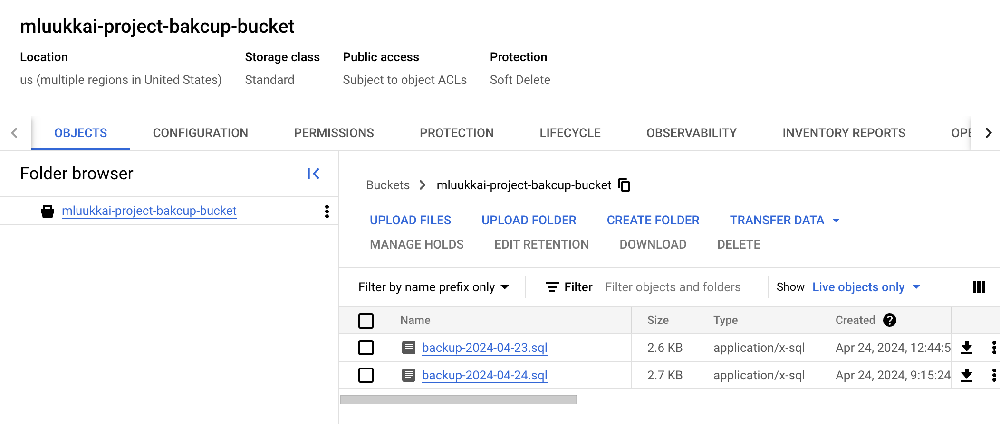

<text-box variant='learningObjectives' name='Learning Objectives'>

After this section you can

- Compare DBaaS to a self hosted solution

- Have the pods in the cluster autoscale

- Have the cluster itself autoscale

</text-box>


## Volumes again ##

Now we arrive at an intersection. We can either start using a Database as a Service (DBaaS) such as the Google Cloud SQL in our case or just use the PersistentVolumeClaims with our own Postgres images and let the Google Kubernetes Engine take care of storage via PersistentVolumes for us.

Both solutions are widely used.

<exercise name='Exercise 3.06: DBaaS vs DIY'>

  Do a pros/cons comparison of the solutions in terms of meaningful differences. This includes **at least** the required work and costs to initialize as well as the maintenance. Backup methods and their ease of usage should be considered as well.

  Write your answer in the README of the project.

</exercise>

<exercise name='Exercise 3.07: Backup'>

In [part 2](/part-2/4-statefulsets-and-jobs#jobs-and-cronjobs) we did a Job that made a backup of our Database using the command *pg_dump*. Unfortunately, the backup was not saved anywhere. Create now a CronJob that makes a backup of your database (once per 24 hours) and saves it to [Google Object Storage](https://cloud.google.com/storage).

In this exercise, you can create the secret for the cloud access from the command line, thus, there is no need to create it in the GitHub action.

When the cron job is working, you can e.g. download the backups using the Google Cloud Console:



</exercise>

## Scaling ##

Scaling can be either horizontal scaling or vertical scaling. Vertical scaling is the act of increasing resources available to a pod or a node. Horizontal scaling is what we most often mean when talking about scaling: increasing the number of pods or nodes. We'll now focus on horizontal scaling.

### Scaling pods ###

There are multiple reasons for scaling an application. The most common reason is that the number of requests an application receives exceeds the number of requests that can be processed. Limitations are often either the amount of requests that a framework is intended to handle or the actual CPU or RAM.

I've prepared an [application](https://github.com/kubernetes-hy/material-example/tree/master/app7) that is rather CPU-intensive. There is a readily compiled Docker image `jakousa/dwk-app7:e11a700350aede132b62d3b5fd63c05d6b976394`. The application accepts a query parameter _?fibos=25_  that is used to control how long the computation is. You should use values between 15 and 30.

Here is the configuration to get the app up and running:

**deployment.yaml**

```yaml
apiVersion: apps/v1
kind: Deployment
metadata:
  name: cpushredder-dep
spec:
  replicas: 1
  selector:
    matchLabels:
      app: cpushredder
  template:
    metadata:
      labels:
        app: cpushredder
    spec:
      containers:
        - name: cpushredder
          image: jakousa/dwk-app7:e11a700350aede132b62d3b5fd63c05d6b976394
          resources:
            limits:
              cpu: "150m"
              memory: "100Mi"
```

Note that finally, we have set the [resource limits](https://kubernetes.io/docs/concepts/configuration/manage-resources-containers/) for a Deployment as well. The suffix of the CPU limit "m" stands for "thousandth of a core". Thus `150m` equals 15% of a single CPU core (`150/1000=0,15`).

The service looks completely familiar by now.

**service.yaml**

```yaml
apiVersion: v1
kind: Service
metadata:
  name: cpushredder-svc
spec:
  type: LoadBalancer
  selector:
    app: cpushredder
  ports:
    - port: 80
      protocol: TCP
      targetPort: 3001
```

Next we have [HorizontalPodAutoscaler](https://kubernetes.io/docs/tasks/run-application/horizontal-pod-autoscale/). This is an exciting new Resource for us to work with.

**horizontalpodautoscaler.yaml**

```yaml
apiVersion: autoscaling/v1
kind: HorizontalPodAutoscaler
metadata:
  name: cpushredder-hpa
spec:
  scaleTargetRef:
    apiVersion: apps/v1
    kind: Deployment
    name: cpushredder-dep
  minReplicas: 1
  maxReplicas: 6
  targetCPUUtilizationPercentage: 50
```

HorizontalPodAutoscaler automatically scales pods horizontally. The yaml here defines what is the target Deployment, how many minimum replicas and what is the maximum replica count. The target CPU Utilization is defined as well. If the CPU utilization exceeds the target then an additional replica is created until the max number of replicas.

Let us now try what happens:

```console
$ kubectl top pod -l app=cpushredder
  NAME                               CPU(cores)   MEMORY(bytes)
  cpushredder-dep-85f5b578d7-nb5rs   1m           20Mi

$ kubectl get hpa
  NAME              REFERENCE                    TARGETS   MINPODS   MAXPODS   REPLICAS   AGE
  cpushredder-hpa   Deployment/cpushredder-dep   0%/50%    1         6         1          62s

$ kubectl get svc
  NAME              TYPE           CLUSTER-IP      EXTERNAL-IP      PORT(S)        AGE
  cpushredder-svc   LoadBalancer   10.31.254.209   35.228.149.206   80:32577/TCP   94s
```

Opening the external-ip, above http://35.228.149.206, in your browser will start one process that will take some CPU. Refresh the page a few times and you should see that if you request above the limit the pod will be taken down.

```console
$ kubectl logs -f cpushredder-dep-85f5b578d7-nb5rs
  Started in port 3001
  Received a request
  started fibo with 20
  Received a request
  started fibo with 20
  Fibonacci 20: 10946
  Closed
  Fibonacci 20: 10946
  Closed
  Received a request
  started fibo with 20
```

After a few requests we will see the *HorizontalPodAutoscaler* create a new replica as the CPU utilization rises. As the resources are fluctuating, sometimes very greatly due to increased resource usage on start or exit, the *HPA* will by default wait 5 minutes between downscaling attempts. If your application has multiple replicas even at 0%/50% just wait. If the wait time is set to a value that's too short for stable statistics of the resource usage the replica count may start "thrashing".

I recommend opening the cluster in Lens and just refreshing the page and looking at what happens in the cluster. If you do not have Lens installed, `kubectl get deployments --watch` and `kubectl get pods --watch` show the behavior in real time as well.

By default it will take 300 seconds to scale down. You can change the stabilization window by adding the following to the HorizontalPodAutoscaler:

```yaml
behavior:
  scaleDown:
    stabilizationWindowSeconds: 30
```

Figuring out autoscaling with HorizontalPodAutoscalers can be one of the more challenging tasks. Choosing which resources to look at and when to scale is not easy. In our case, we only stress the CPU. But your applications may need to scale based on, and take into consideration, a number of resources e.g. network, disk or memory.

<exercise name='Exercise 3.08: Project v1.5'>

  Set sensible resource limits for the project. The exact values are not important. Test what works.

</exercise>

<exercise name='Exercise 3.09: Resource limits'>

  Set sensible resource limits for the Ping-pong and Log output applications. The exact values are not important. Test what works.

</exercise>

### Scaling nodes ###

Scaling nodes is a supported feature in GKE. Via the cluster autoscaling feature we can use the right amount of nodes needed.

```console
$ gcloud container clusters update dwk-cluster --zone=europe-north1-b --enable-autoscaling --min-nodes=1 --max-nodes=5
  Updated [https://container.googleapis.com/v1/projects/dwk-gke/zones/europe-north1-b/clusters/dwk-cluster].
  To inspect the contents of your cluster, go to: https://console.cloud.google.com/kubernetes/workload_/gcloud/europe-north1-b/dwk-cluster?project=dwk-gke
```

For a more robust cluster see examples on creation here: <https://cloud.google.com/kubernetes-engine/docs/concepts/cluster-autoscaler>


Cluster autoscaling may disrupt pods by moving them around as the number of nodes increases or decreases. To solve possible issues with this, the resource [PodDisruptionBudget](https://kubernetes.io/docs/concepts/workloads/pods/disruptions/#how-disruption-budgets-work) can be used. With the resource, the requirements for a pod can be defined via two of the fields: _minAvailable_ and _maxUnavailable_.

**poddisruptionbudget.yaml**

```yaml
apiVersion: policy/v1beta1
kind: PodDisruptionBudget
metadata:
  name: example-app-pdb
spec:
  maxUnavailable: 50%
  selector:
    matchLabels:
      app: example-app
```

This configuration would ensure that no more than half of the pods can be unavailable. The Kubernetes documentation states "The budget can only protect against voluntary evictions, not all causes of unavailability."

In addition to scaling to multiple nodes (Horizontal scaling), you can also scale individual nodes with [VerticalPodAutoscaler](https://cloud.google.com/kubernetes-engine/docs/concepts/verticalpodautoscaler). These help ensure you are always using 100% of the resources you pay for.

_Side note:_ Kubernetes also offers the possibility to limit resources per namespace. This can prevent apps in the development namespace from consuming too many resources. Google has created a great video that explains the possibilities of the `ResourceQuota` object.

<iframe width="560" height="315" src="https://www.youtube-nocookie.com/embed/xjpHggHKm78" frameborder="0" allow="accelerometer; encrypted-media; gyroscope; picture-in-picture" allowfullscreen></iframe>

<exercise name='Exercise 3.10: Project v1.6'>

  GKE includes monitoring systems already so we can just enable the monitoring.

  Read documentation for Kubernetes Engine Monitoring [here](https://cloud.google.com/monitoring/kubernetes-engine) and setup logging for the project in GKE.

  You can optionally include Prometheus as well.

  Submit a picture of the logs when a new todo is created.

</exercise>

