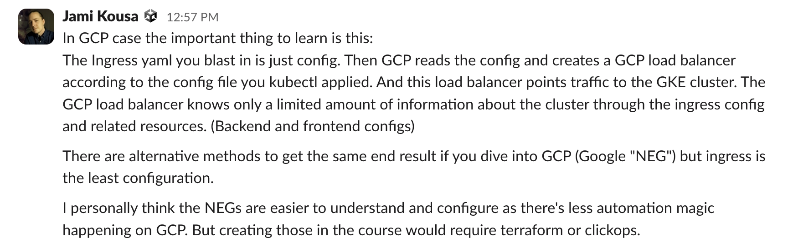
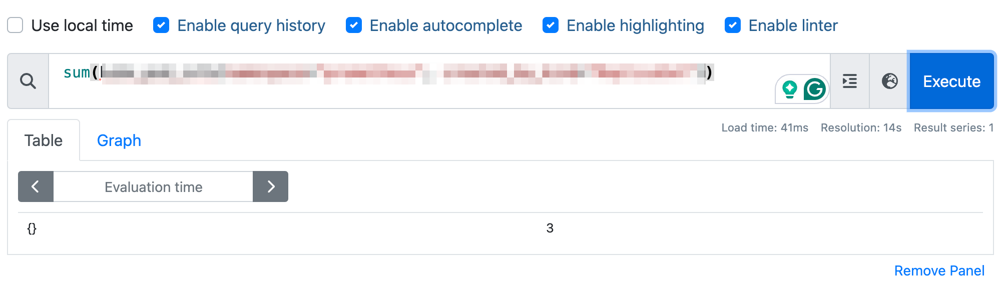
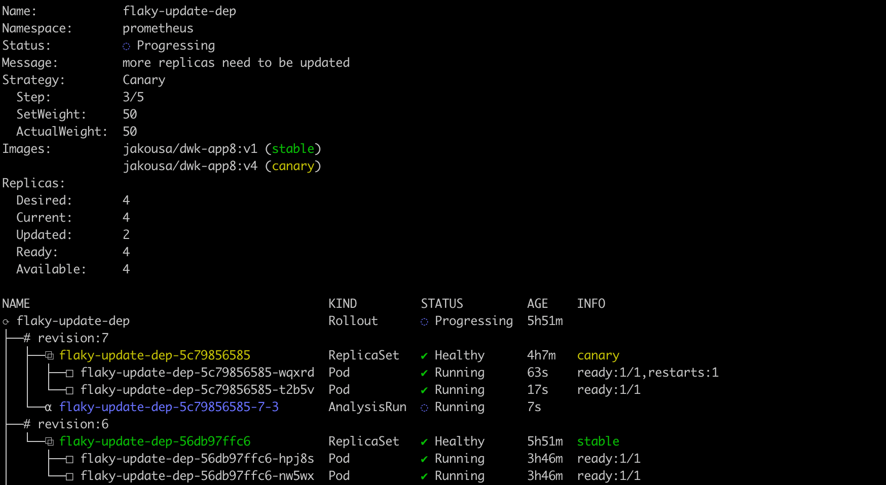

<text-box variant='learningObjectives' name='Learning Objectives'>

After this section, you can

- Compare update strategies

- **Confidently** deploy software with canary releases

- Use Prometheus for custom queries

</text-box>

In the previous part, we did automated updates with a deployment pipeline. The update *just worked*, but we have no idea how the update actually happened, other than that a pod was changed. Let us now look how we can make the update process safer to help us reach a higher number of [nines](https://en.wikipedia.org/wiki/High_availability) in the availability.

There are multiple update/deployment/release strategies. We will focus on two of them:

- Rolling update
- Canary release

Both of these update strategies are designed to make sure that the application works during and after an update. Rather than updating every pod at the same time, the idea is to update the pods one at a time and confirm that the application works.

### Rolling update ###

By default, Kubernetes initiates a [rolling update](https://kubernetes.io/docs/concepts/workloads/management/#updating-your-application-without-an-outage) when we change the image. That means that every pod is updated sequentially. The rolling update is a great default since it enables the application to be available during the update. If we decide to push an image that does not work, the update will automatically stop.

I've prepared an application with 5 versions here. The one with tag v1 works always, v2 never works, v3 works 90% of the time, v4 will die after 20 seconds and v5 works always.

**deployment.yaml**

```yaml
apiVersion: apps/v1
kind: Deployment
metadata:
  name: flaky-update-dep
spec:
  replicas: 4
  selector:
    matchLabels:
      app: flaky-update
  template:
    metadata:
      labels:
        app: flaky-update
    spec:
      containers:
        - name: flaky-update
          image: jakousa/dwk-app8:v1
```

```console
$ kubectl apply -f deployment.yaml
  deployment.apps/flaky-update-dep created

$ kubectl get po
  NAME                                READY   STATUS    RESTARTS   AGE
  flaky-update-dep-7b5fd9ffc7-27cxt   1/1     Running   0          87s
  flaky-update-dep-7b5fd9ffc7-mp8vd   1/1     Running   0          88s
  flaky-update-dep-7b5fd9ffc7-m4smm   1/1     Running   0          87s
  flaky-update-dep-7b5fd9ffc7-nzl98   1/1     Running   0          88s
```

Now change the tag to v2 and apply it.

```console
$ kubectl apply -f deployment.yaml
$ kubectl get po --watch
...
```

You can see the rolling update performed but unfortunately, the application no longer works. The application is running, it's just that there's a bug that prevents it from working correctly. How do we communicate this malfunction outside the application? This is where [*ReadinessProbes*](https://kubernetes.io/docs/tasks/configure-pod-container/configure-liveness-readiness-startup-probes/#define-readiness-probes) come in.

**Kubernetes Best Practices - Kubernetes Health Checks with Readiness and Liveness Probes**

<iframe width="560" height="315" src="https://www.youtube-nocookie.com/embed/mxEvAPQRwhw" frameborder="0" allow="accelerometer; encrypted-media; gyroscope; picture-in-picture" allowfullscreen></iframe>

With a *ReadinessProbe* Kubernetes can check if a pod is ready to process requests. The application has an endpoint [/healthz](https://stackoverflow.com/questions/43380939/where-does-the-convention-of-using-healthz-for-application-health-checks-come-f) in port 3541, and we can use that to test for health. It will simply answer with status code 500 if it's not working and 200 if it is.

Let's roll the version back to v1 as well, so we can test the update to v2 again.

**deployment.yaml**

```yaml
apiVersion: apps/v1
kind: Deployment
metadata:
  name: flaky-update-dep
spec:
  replicas: 4
  selector:
    matchLabels:
      app: flaky-update
  template:
    metadata:
      labels:
        app: flaky-update
    spec:
      containers:
        - name: flaky-update
          image: jakousa/dwk-app8:v1
          readinessProbe:
            initialDelaySeconds: 10 # Initial delay until the readiness is tested
            periodSeconds: 5 # How often to test
            httpGet:
               path: /healthz
               port: 3541
```

Here the *initialDelaySeconds* and *periodSeconds* will mean that the probe is sent 10 seconds after the container is up and every 5 seconds after that. Now if we change the tag to v2 and apply it, the result will look like this:

```console
$ kubectl apply -f deployment.yaml
  deployment.apps/flaky-update-dep configured

$ kubectl get po
  NAME                                READY   STATUS    RESTARTS   AGE
  flaky-update-dep-f5c79dbc-8lnqm     1/1     Running   0          115s
  flaky-update-dep-f5c79dbc-86fmd     1/1     Running   0          116s
  flaky-update-dep-f5c79dbc-qzs9p     1/1     Running   0          98s
  flaky-update-dep-54888b877b-dkctl   0/1     Running   0          25s
  flaky-update-dep-54888b877b-dbw29   0/1     Running   0          24s
```

Here three of the pods are completely functional, one of v1 was dropped to make way for the v2 ones, but since they do not work, they are never READY and the update can not continue.

### GKE ingress and pod readiness

If you are using Ingress in your app, you should note that the ReadinessProbe does not work quite like one would expect, requests get also routed to pods that are not _ready_. The documentation [recommends](https://cloud.google.com/kubernetes-engine/docs/concepts/ingress#interpreted_hc) the following:

_If serving Pods for your Service contain multiple containers, or if you're using the GKE Enterprise Ingress controller, you should use a BackendConfig CRD to define health check parameters._ So if you want to use the GKE default ingress, [BackendConfig](https://cloud.google.com/kubernetes-engine/docs/concepts/ingress#direct_hc_instead) should be defined. Instead of using a provider-specific Ingress, the
better option is to use e.g. [ingress-nginx](https://github.com/kubernetes/ingress-nginx/tree/main) that happens similarly no matter where it is run.

Using _ingress-nginx_ is easy. First, it needs to be installed by running the following commands:

```bash
$ repo add ingress-nginx https://kubernetes.github.io/ingress-nginx
$ helm repo update
$ helm install nginx-ingress ingress-nginx/ingress-nginx
```

In the [ingress spec](https://kubernetes.io/docs/reference/kubernetes-api/service-resources/ingress-v1/#IngressSpec) the _ingressClassName_ specifies the Ingress controller that is used:

```yaml
apiVersion: networking.k8s.io/v1
kind: Ingress
metadata:
  name: ping-pong-ingress
spec:
  ingressClassName: nginx # this is added
  rules:
  - http:
      # tules are here
```

The available ingress controllers (besides the default) can be checked with _kubectl_ as follows:

```bash
$ kubectl get IngressClass
NAME    CONTROLLER             PARAMETERS   AGE
nginx   k8s.io/ingress-nginx   <none>       3h38m
```

There is a lesson to learn:



<exercise name='Exercise 4.01: Readiness Probe'>

  Create a ReadinessProbe for the Ping-pong application. It should be ready when it has a connection to the database.

  And another ReadinessProbe for Log output application. It should be ready when it can receive data from the Ping-pong application.

  Test that it works by applying everything but the database statefulset. The output of `kubectl get po` should look like this before the database is available:

  ```console
NAME                             READY   STATUS    RESTARTS   AGE
logoutput-dep-7f49547cf4-ttj4f   1/2     Running   0          21s
pingpong-dep-9b698d6fb-jdgq9     0/1     Running   0          21s
  ```

  Adding the database should automatically move the READY states to 2/2 and 1/1 for Log output and Ping-pong respectively.

</exercise>

Even though v2 didn't work, at least the application is working. We can just push a new update on top of the v2. Let's try the v4 which should break after a short while:

```console
$ kubectl apply -f deployment.yaml
  deployment.apps/flaky-update-dep configured
```

Now the ReadinessProbe may pass for the first 20 seconds, but soon enough every pod will break. Unfortunately *ReadinessProbe* cannot do anything about it, the deployment was successful but the application is buggy.

```console
$ kubectl get po
  NAME                               READY   STATUS    RESTARTS   AGE
  flaky-update-dep-dd78944f4-vv27w   0/1     Running   0          111s
  flaky-update-dep-dd78944f4-dnmcg   0/1     Running   0          110s
  flaky-update-dep-dd78944f4-zlh4v   0/1     Running   0          92s
  flaky-update-dep-dd78944f4-zczmw   0/1     Running   0          90s
```

Let's roll back to the previous version. This may come in handy, if you ever are in a panic mode and need to roll an update back:

```console
$ kubectl rollout undo deployment flaky-update-dep
  deployment.apps/flaky-update-dep rolled back
```

This will roll back into the previous version. Since it was v2, which doesn't work, we need to use a flag with the undo:

```console
$ kubectl describe deployment flaky-update-dep | grep Image
    Image:        jakousa/dwk-app8:v2

$ kubectl rollout undo deployment flaky-update-dep --to-revision=1
  deployment.apps/flaky-update-dep rolled back

$ kubectl describe deployment flaky-update-dep | grep Image
    Image:        jakousa/dwk-app8:v1
```

Read `kubectl rollout undo --help` to find out more!

There's another probe that could've helped us in a situation like the v4. [*LivenessProbes*](https://kubernetes.io/docs/tasks/configure-pod-container/configure-liveness-readiness-startup-probes/#define-readiness-probes) can be configured similarly to *ReadinessProbes*, but if the check fails the container will be restarted.

**deployment.yaml**

```yaml
apiVersion: apps/v1
kind: Deployment
metadata:
  name: flaky-update-dep
spec:
  replicas: 4
  selector:
    matchLabels:
      app: flaky-update
  template:
    metadata:
      labels:
        app: flaky-update
    spec:
      containers:
        - name: flaky-update
          image: jakousa/dwk-app8:v1
          readinessProbe:
            initialDelaySeconds: 10 # Initial delay until the readiness is tested
            periodSeconds: 5 # How often to test
            httpGet:
               path: /healthz
               port: 3541
          livenessProbe:
            initialDelaySeconds: 20 # Initial delay until the liveness is tested
            periodSeconds: 5 # How often to test
            httpGet:
               path: /healthz
               port: 3541
```

With this let's just deploy the worst of the versions, v3.

```console
$ kubectl apply -f deployment.yaml
  deployment.apps/flaky-update-dep configured
```

After a while, it may look something like this (if you're lucky).

```console
$ kubectl get po
  NAME                                READY   STATUS    RESTARTS   AGE
  flaky-update-dep-fd65cd468-4vgwx   1/1     Running   3          2m30s
  flaky-update-dep-fd65cd468-9h877   0/1     Running   4          2m49s
  flaky-update-dep-fd65cd468-jpz2m   0/1     Running   3          2m13s
  flaky-update-dep-fd65cd468-529nr   1/1     Running   4          2m50s
```

At least something is working!

If your app is slow to start, a [StartupProbe](https://kubernetes.io/docs/tasks/configure-pod-container/configure-liveness-readiness-startup-probes/#define-startup-probes) can be used to delay the liveness probe and prevent it from firing prematurely. You may require it in real life but is not discussed further in this course.

<exercise name='Exercise 4.02: Project v1.7'>

  Create the required probes and endpoint for The Project to ensure that it's working and connected to a database.

  Test that the probe indeed works with a version without database access, for example by supplying a wrong database URL or credentials.

</exercise>

### Canary release ###

With rolling updates, when including the Probes, we could create releases with no downtime for users. Sometimes this is not enough and you need to be able to do a _partial release_ for some users and get data for the upcoming release. [Canary release](https://martinfowler.com/bliki/CanaryRelease.html) is the term used to describe a release strategy in which we introduce a subset of the users to a new version of the application. When the confidence in the new release grows, the number of users in the new version can be increased until the old version is no longer used.

At the moment of writing this, Canary is not a strategy for deployments that Kubernetes would provide out of the box. This may be due to the ambiguity of the methods for canary release. We will use [Argo Rollouts](https://argoproj.github.io/argo-rollouts/) to test one type of canary release:

```console
$ kubectl create namespace argo-rollouts
$ kubectl apply -n argo-rollouts -f https://github.com/argoproj/argo-rollouts/releases/latest/download/install.yaml
```

Now we have a new resource [Rollout](https://argoproj.github.io/argo-rollouts/migrating/) available to us. The Rollout will replace our previously created deployment and enable us to use a new field:

**rollout.yaml**

```yaml
apiVersion: argoproj.io/v1alpha1
kind: Rollout
metadata:
  name: flaky-update-dep
spec:
  replicas: 4
  selector:
    matchLabels:
      app: flaky-update
  strategy:
    canary:
      steps:
      - setWeight: 25
      - pause:
          duration: 30s
      - setWeight: 50
      - pause:
          duration: 30s
  template:
    metadata:
      labels:
        app: flaky-update
    spec:
      containers:
        - name: flaky-update
          image: jakousa/dwk-app8:v1
          readinessProbe:
            initialDelaySeconds: 10 # Initial delay until the readiness is tested
            periodSeconds: 5 # How often to test
            httpGet:
               path: /healthz
               port: 3541
          livenessProbe:
            initialDelaySeconds: 20 # Initial delay until the liveness is tested
            periodSeconds: 5 # How often to test
            httpGet:
               path: /healthz
               port: 3541
```

The above strategy will first move 25% ([*setWeight*](https://argoproj.github.io/argo-rollouts/features/canary/#overview)) of the pods to a new version (in our case 1 pod) after which it will wait for 30 seconds, move to 50% of pods and then wait for 30 seconds until every pod is updated. The [kubectl plugin](https://argoproj.github.io/argo-rollouts/features/kubectl-plugin/) from Argo also offers us [promote](https://argoproj.github.io/argo-rollouts/generated/kubectl-argo-rollouts/kubectl-argo-rollouts_promote/) command to enable us to pause the rollout indefinitely and then use the promote to move forward.

There are other options such as the [*maxUnavailable*](https://argoproj.github.io/argo-rollouts/features/bluegreen/#maxunavailable) but the defaults will work for us. However, simply rolling slowly to production will not be enough for a canary deployment. Just like with rolling updates _we need to know the status of the application_.

With another custom resource we've already installed with Argo Rollouts called [AnalysisTemplate](https://argoproj.github.io/argo-rollouts/architecture/#analysistemplate-and-analysisrun) we will be able to define a test that doesn't let the broken versions through.

Let us extend our rollout with an analysis:

```yaml
  ...
  strategy:
    canary:
      steps:
      - setWeight: 50
      - analysis:
          templates:
          - templateName: restart-rate
    # ...
  ...
```

The analysis will be using a template called _restart-rate_. Next, we have to define how the analysis will be done. For that, we shall need Prometheus which we briefly used in [part 2](/part-2/5-monitoring).

<exercise name='Exercise 4.03: Prometheus'>

  Ok, we started up Prometheus in part 2, but we have barely scratched the surface. Let's do a single hands-on query to learn more.

  Start now Prometheus with Helm and use port-forward to access the GUI website. Port 9090 is the default for Prometheus:

```console
$ kubectl -n prometheus get pods
 NAME                                                              READY   STATUS    RESTARTS   AGE
  alertmanager-kube-prometheus-stack-1714-alertmanager-0            2/2     Running   0          3h19m
  kube-prometheus-stack-1714-operator-94c596dbd-n5pcl               1/1     Running   0          3h19m
  kube-prometheus-stack-1714644114-grafana-54cbbc4c46-m26f6         3/3     Running   0          3h19m
  kube-prometheus-stack-1714644114-kube-state-metrics-7cb796tpjbd   1/1     Running   0          3h19m
  kube-prometheus-stack-1714644114-prometheus-node-exporter-kdpln   1/1     Running   0          3h19m
  kube-prometheus-stack-1714644114-prometheus-node-exporter-sp9pg   1/1     Running   0          3h19m
  kube-prometheus-stack-1714644114-prometheus-node-exporter-vbbjk   1/1     Running   0          3h19m
  prometheus-kube-prometheus-stack-1714-prometheus-0                2/2     Running   0          3h19m

$ kubectl -n prometheus port-forward prometheus-kube-prometheus-stack-1714-prometheus-0 9090:9090
  Forwarding from 127.0.0.1:9090 -> 9090
  Forwarding from [::1]:9090 -> 9090
```

  And now accessing [http://localhost:9090](http://localhost:9090) will allow us to write queries.

  **Write a query** that shows the number of pods created by StatefulSets in _prometheus_ namespace. For the above setup the _Value_ should be 3 different pods:



  Query for "kube\_pod\_info" should have the required fields to filter through. See [documentation](https://prometheus.io/docs/prometheus/latest/querying/basics/) for help with querying.

</exercise>

The AnalysisTemplate will, in our case, use Prometheus to query the state of the deployment. The query result is then compared to a preset value. In this simplified case, if the number of overall restarts over the last 2 minutes is higher than two, it will fail the analysis. *initialDelay* will ensure that the test is not run until the data required is gathered. The template looks as follows:

**analysistemplate.yaml**

```yaml
apiVersion: argoproj.io/v1alpha1
kind: AnalysisTemplate
metadata:
  name: restart-rate
spec:
  metrics:
  - name: restart-rate
    initialDelay: 2m
    successCondition: result < 2
    provider:
      prometheus:
        address: http://kube-prometheus-stack-1602-prometheus.prometheus.svc.cluster.local:9090 # DNS name for my Prometheus, find yours with kubectl describe svc ...
        query: |
          scalar(
            sum(kube_pod_container_status_restarts_total{namespace="default", container="flaky-update"}) -
            sum(kube_pod_container_status_restarts_total{namespace="default", container="flaky-update"} offset 2m)
          )
```

With the new Rollout and AnalysisTemplate, we can safely try to deploy any version. Deploy for v2 is prevented with the Probes we set up. Deploy for v3 will automatically roll back when it notices that it has random crashes. The v4 will also eventually fail, but the short 2 minutes to test may still let a version get deployed.

The Argo Rollouts [kubectl plugin](https://argoproj.github.io/argo-rollouts/features/kubectl-plugin/) allows you to visualize the Rollout and its related resources. To watch the Rollout as it deploys, we can run it in watch mode:

```bash
kubectl argo rollouts get rollout flaky-update-dep --watch
```



Besides the pods, we see here also [AnalysisRun](https://argoproj.github.io/argo-rollouts/architecture/#analysistemplate-and-analysisrun) that is the instance of the test being run. You might also want to try Argo Rollouts [dashboard](https://argoproj.github.io/argo-rollouts/dashboard/), which gives even fancier visualization of the state of your rollouts.

In general, the *AnalysisTemplate* is not dependent on Prometheus and could use a different source, such as a JSON endpoint, instead.

<exercise name='Exercise 4.04: Project v1.8'>

  Create an AnalysisTemplate for The Project that will follow the CPU usage of all containers in the namespace.

  If the CPU usage **rate** sum for the namespace increases above a set value (you may choose a good hardcoded value for your project) within 10 minutes, revert the update.

  Make sure that the application doesn't get updated, if the value is set too low.

</exercise>

### Other deployment strategies ###

Kubernetes supports [Recreate](https://kubernetes.io/docs/concepts/workloads/controllers/deployment/#recreate-deployment) strategy which takes down the previous pods and replaces everything with the updated one. This creates a moment of downtime for the application but ensures that different versions are not running at the same time. Argo Rollouts supports [BlueGreen](https://argoproj.github.io/argo-rollouts/features/bluegreen/) strategy, in which a new version is run side by side to the new one, but traffic is switched between the two at a certain point, such as after running update scripts or after your QA team has approved the new version.

<exercise name='Exercise 4.05: Project v1.9'>

  Speaking of updating.
  Our todo application could use "Done" field for todos that are already done.
  It should be a PUT request to `/todos/<id>`.

</exercise>

