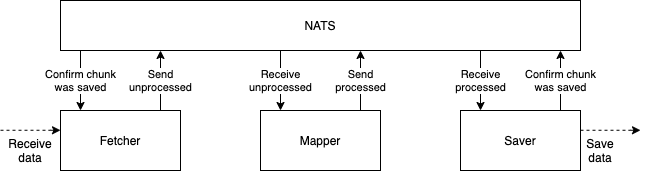
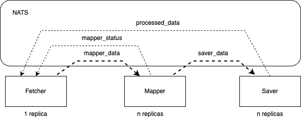
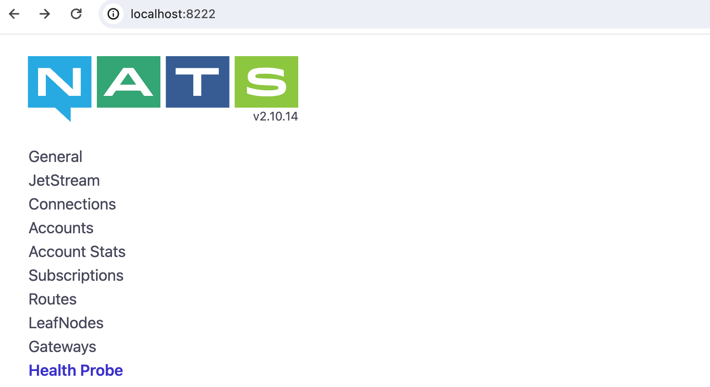
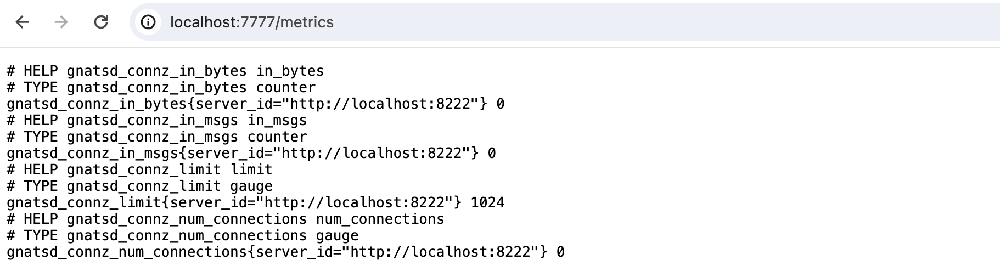
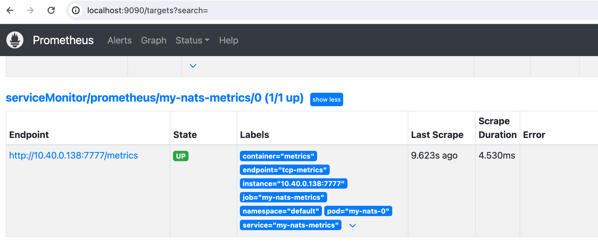
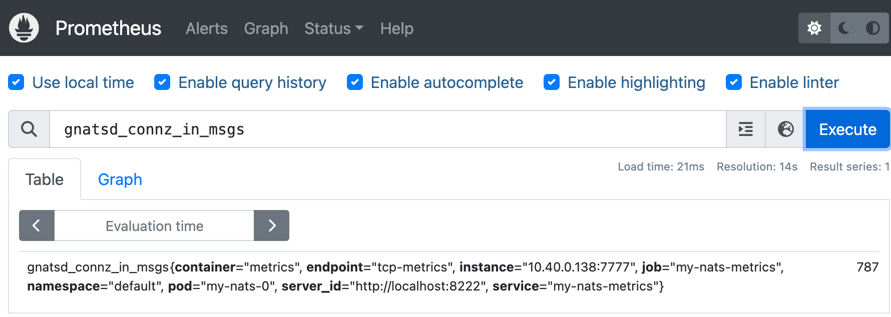
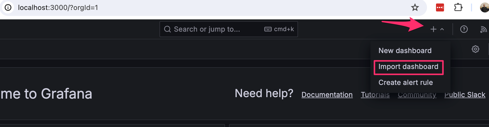
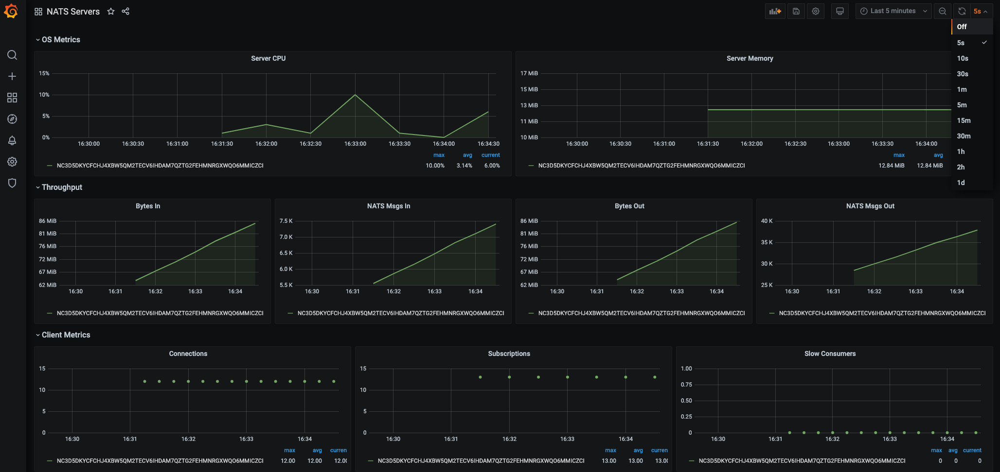

<text-box variant='learningObjectives' name='Learning Objectives'>

After this section, you can

- Create a complex microservice architecture with NATS as the messaging system

</text-box>

[Message queues](https://en.wikipedia.org/wiki/Message_queue) are a method for communication between services. They have a wide range of use cases and are helpful when you want to scale applications. A number of HTTP REST API services that want to communicate with each other require that the services know each other’s addresses. Whereas when using message queues, messages are sent to and received from the message queue, respectively.

In this section we will be using a messaging system called [NATS](https://docs.nats.io/) to explore the benefits of messaging. Before we get started we will have a look at the basics of NATS.

In NATS applications are communicating by sending and receiving messages. These messages are addressed and identified by [subjects](https://docs.nats.io/nats-concepts/subjects). The sender _publishes_ the message with a subject. The receivers _subscribe_ to subjects to get the published messages. In the default [publish-subscribe](https://docs.nats.io/nats-concepts/core-nats/pubsub) model of operation, all the subscribers of the subject receive the published message. It is also possible to use a [queue](https://docs.nats.io/nats-concepts/core-nats/queue) model, where each published message is given just to **one** subscriber.

NATS provides some different message delivery semantics or modes of operation. The basic functionality provided by [Core NATS](https://docs.nats.io/nats-concepts/core-nats) is _at most once_ messaging: if no subscribers are listening on the subject (no subject match), or are not active when the message is sent, the message is not received. By using the [Jetstream](https://docs.nats.io/nats-concepts/jetstream) functionality, it is also possible to achieve _at least once_ or _exactly once_ messaging with persistence.

With these in mind, we can design our first application that uses messaging for communication.

We have a data set of 100000 JSON objects that we need to do some heavy processing on and then save the processed data. Unfortunately processing a single JSON object takes so long that processing all of the data would require hours of work. To solve this I've split the application into smaller services that we can scale individually.

The [application](https://github.com/kubernetes-hy/material-example/tree/master/app9) is divided in 3 parts:

- Fetcher, which fetches unprocessed data and passes it to NATS.
- Mapper, which processes the data from NATS and after processing sends it back to NATS.
- Saver, which receives the processed data from NATS and finally (could) save it.



As mentioned the messaging in NATS is centered around _subjects_. In general, there is one subject per purpose. The app uses four subjects:



Fetcher splits the data into chunks of 100 objects and keeps a record of which chunks have not been processed. The application is designed so that the Fetcher can not be scaled.

The Fetcher subscribes to subject *mapper_status* and will wait for a Mapper to publish a message confirming that it's ready to process data. When the Fetcher receives this information, it publishes a chunk of data to subject *mapper_data* and starts again from the beginning.

As mentioned, when a mapper is ready to process more data, it publishes the info of availability to subject *mapper_status*. It also subscribes to subject *mapper_data*. When the Mapper gets a message, it processes it and publishes the processed data to subject *saver_data* and starts all over again. The subject *mapper_data* operates in [queue](https://docs.nats.io/nats-concepts/core-nats/queue) mode so each published message is received by only one Mapper.

The Saver subscribes to subject *saver_data*. Once receiving a message it saves it and publishes an acknowledgement message in the subject *processed_data*. The Fetcher subscribes to this subject and keeps track of what chunks of data have been saved. So even if any part of the application crashes all of the data will eventually be processed and saved. Also, the subject *saver_data* is used in queue mode so each chunk of processed data is taken care of only one Saver.

For simplicity, saving to a database and fetching from external API are omitted from our app.

Before deploying the app we shall use Helm to install NATS into our cluster. Instead of the Helm chart provided by the NATS team, we shall use the chart provided by [Bitnami](https://bitnami.com/).

The chart is [documentation](https://artifacthub.io/packages/helm/bitnami/nats) describing a set of
[parameters](https://artifacthub.io/packages/helm/bitnami/nats#parameters) that can be used to modify the NATS configuration. Let us now disable the authentication by setting _auth.enabled_ to value _false_.

Parameters can be set in the installation as follows:


```console
$ helm install --set auth.enabled=false my-nats oci://registry-1.docker.io/bitnamicharts/nats

  NAME: my-nats
  LAST DEPLOYED: Wed May  8 22:57:17 2024
  NAMESPACE: default
  STATUS: deployed
  REVISION: 1
  ...
  NATS can be accessed via port 4222 on the following DNS name from within your cluster:

   my-nats.default.svc.cluster.local

  NATS monitoring service can be accessed via port 8222 on the following DNS name from within your cluster:

    my-nats.default.svc.cluster.local

  To access the Monitoring svc from outside the cluster, follow the steps below:

  1. Get the NATS monitoring URL by running:

      echo "Monitoring URL: http://127.0.0.1:8222"
      kubectl port-forward --namespace default svc/my-nats 8222:8222

  2. Open a browser and access the NATS monitoring browsing to the Monitoring URL
  ...
```

The installation prints many kinds of useful info for us.

We are now ready to deploy our [app](https://github.com/kubernetes-hy/material-example/tree/master/app9) that uses [nats.js](https://github.com/nats-io/nats.js) as the client library. Note that the example app uses nats.js version 1.5. The current version of the library has breaking changes in the api.

The **deployment.yaml** that passes the connect URL _nats://my-nats:4222_ to pods in env variable *NATS_URL* looks like the following:

```yaml
apiVersion: apps/v1
kind: Deployment
metadata:
  name: mapper-dep
spec:
  replicas: 10
  selector:
    matchLabels:
      app: mapper
  template:
    metadata:
      labels:
        app: mapper
    spec:
      containers:
        - name: mapper
          image: jakousa/dwk-app9-mapper:0bcd6794804c367684a9a79bb142bb4455096974
          env:
            - name: NATS_URL
              value: nats://my-nats:4222
---
apiVersion: apps/v1
kind: Deployment
metadata:
  name: fetcher-dep
spec:
  replicas: 1
  selector:
    matchLabels:
      app: fetcher
  template:
    metadata:
      labels:
        app: fetcher
    spec:
      containers:
        - name: fetcher
          image: jakousa/dwk-app9-fetcher:0bcd6794804c367684a9a79bb142bb4455096974
          env:
            - name: NATS_URL
              value: nats://my-nats:4222
---
apiVersion: apps/v1
kind: Deployment
metadata:
  name: saver-dep
spec:
  replicas: 1
  selector:
    matchLabels:
      app: saver
  template:
    metadata:
      labels:
        app: saver
    spec:
      containers:
        - name: saver
          image: jakousa/dwk-app9-saver:0bcd6794804c367684a9a79bb142bb4455096974
          env:
            - name: NATS_URL
              value: nats://my-nats:4222
```

After applying the deployments we can confirm that everything works by reading the logs of the fetcher - `kubectl logs fetcher-dep-7d799bb6bf-zz8hr -f`:

```bash
Ready to send #827
Sent data #827, 831 remaining
Ready to send #776
Sent data #776, 830 remaining
Ready to send #516
Sent data #516, 829 remaining
Ready to send #382
Sent data #382, 828 remaining
Ready to send #709
...
```

We'll want to monitor the state of NATS as well. NATS has a [web service](https://docs.nats.io/running-a-nats-service/nats_admin/monitoring) that provides many kinds of data for monitoring. We can access the service from the browser with `kubectl port-forward my-nats-0 8222:8222` in <http://localhost:8222>:



We are already committed to using Prometheus for monitoring and for that, we need to do some configurations. Firstly we have to enable the [Prometheus exporter](https://github.com/nats-io/prometheus-nats-exporter), which exposes the metrics to port 7777. From the Helm chart [documentation](https://artifacthub.io/packages/helm/bitnami/nats#metrics-parameters) we find out that _metrics.enabled_ should be set to _true_ to enable metrics.

The command [helm upgrade](https://helm.sh/docs/helm/helm_upgrade/) does the trick:

```bash
$ helm upgrade --set metrics.enabled=true,auth.enabled=false my-nats oci://registry-1.docker.io/bitnamicharts/nats

  ...
  3. Get the NATS Prometheus Metrics URL by running:

    echo "Prometheus Metrics URL: http://127.0.0.1:7777/metrics"
    kubectl port-forward --namespace default svc/my-nats-metrics 7777:7777

  4. Access NATS Prometheus metrics by opening the URL obtained in a browser.
```

The output already gives us instructions on how we can connect to the exported with the browser. Let us do it to ensure that everything works:

```bash
kubectl port-forward --namespace default svc/my-nats-metrics 7777:7777
```



Connecting Prometheus to the exporter requires a new resource [ServiceMonitor](https://github.com/prometheus-operator/prometheus-operator/blob/main/Documentation/user-guides/getting-started.md), which is another [Custom Resource Definition](https://kubernetes.io/docs/concepts/extend-kubernetes/api-extension/custom-resources/) (CDR).

We could create the resource by ourselves but that is not needed since with a little more configuration, the Helm chart will do it for us. The following settings will create the ServiceMonitor:

´´´
metrics.serviceMonitor.enabled=true
metrics.serviceMonitor.namespace=prometheus
´´´

Since we are already setting value to quite many parameters, let us define those in a file:

**myvalues.yaml**

´´´yaml
auth:
  enabled: false

metrics:
  enabled: true
  serviceMonitor:
    enabled: true
    namespace: prometheus
´´´

Now we are ready to upgrade the chart:

´´´bash
helm upgrade -f myvalyes.yaml my-nats oci://registry-1.docker.io/bitnamicharts/nats
´´´

We can confirm that the ServiceMonitor _my-nats-metrics_ is indeed created:

´´´bash
$ kubectl get servicemonitors.monitoring.coreos.com -n prometheus
NAME                                                        AGE
kube-prometheus-stack-1714-alertmanager                     6d10h
kube-prometheus-stack-1714-apiserver                        6d10h
kube-prometheus-stack-1714-coredns                          6d10h
kube-prometheus-stack-1714-kube-controller-manager          6d10h
kube-prometheus-stack-1714-kube-etcd                        6d10h
kube-prometheus-stack-1714-kube-proxy                       6d10h
kube-prometheus-stack-1714-kube-scheduler                   6d10h
kube-prometheus-stack-1714-kubelet                          6d10h
kube-prometheus-stack-1714-operator                         6d10h
kube-prometheus-stack-1714-prometheus                       6d10h
kube-prometheus-stack-1714644114-grafana                    6d10h
kube-prometheus-stack-1714644114-kube-state-metrics         6d10h
kube-prometheus-stack-1714644114-prometheus-node-exporter   6d10h
my-nats-metrics                                             8m8s
´´´

We still need a suitable label for our configuration so that Prometheus knows to listen to the NATS.

Let's use the label that the already existing ServiceMonitors are using. We can check it with the following commands:

```console
$ kubectl -n prometheus get prometheus
  NAME                                    VERSION   REPLICAS   AGE
  kube-prometheus-stack-1714-prometheus   v2.51.2   1          39h

$ kubectl describe prometheus -n prometheus kube-prometheus-stack-1714-prometheus
...
  Service Monitor Selector:
    Match Labels:
      Release:  kube-prometheus-stack-1714644114
...
```

So the label needs to be _release: kube-prometheus-stack-1714644114_ unless we'd like to define a new Prometheus resource. Label is set as the value of _metrics.service.labels_.

Label can be attached to the ServiceMonitor with [kubectl label](https://kubernetes.io/docs/reference/kubectl/generated/kubectl_label/) command:

´´´bash
kubectl label servicemonitors.monitoring.coreos.com -n prometheus my-nats-metrics release=kube-prometheus-stack-1714644114
´´´

Now Prometheus should have access to the new data. Let's check Prometheus:

```console
$ kubectl -n prometheus port-forward prometheus-kube-prometheus-stack-1714-prometheus-0 9090
Forwarding from 127.0.0.1:9090 -> 9090
Forwarding from [::1]:9090 -> 9090
```

If all goes well, the NATS metrics ServiceMonitor is among the list of _targets_:



We can now query the data:



Also the Prometheus API should return a result:

```console
$ curl http://localhost:9090/api/v1/query\?query\=gnatsd_connz_in_msgs
  {
    "status":"success",
    "data":{
        "resultType":"vector",
        "result":[
          {
              "metric":{
                "__name__":"gnatsd_connz_in_msgs",
                "container":"metrics",
                "endpoint":"tcp-metrics",
                "instance":"10.40.0.138:7777",
                "job":"my-nats-metrics",
                "namespace":"default",
                "pod":"my-nats-0",
                "server_id":"http://localhost:8222",
                "service":"my-nats-metrics"
              },
              "value":[
                1715203297.971,
                "1997"
              ]
          }
        ]
    }
  }
```

If the result here is empty, then something is wrong. The result may be a success even if the query doesn't make sense.

Now we just need to add a Grafana dashboard for the data. Let's import a dashboard from [here](https://raw.githubusercontent.com/nats-io/prometheus-nats-exporter/5084a32850823b59069f21f3a7dde7e488fef1c6/walkthrough/grafana-nats-dash.json) instead of configuring our own.

```console
$ kubectl -n prometheus port-forward kube-prometheus-stack-1602180058-grafana-59cd48d794-4459m 3000
```

Here we can paste the JSON using the "Import dashboard" and by choosing Prometheus as the source on the following page.



And now we have a simple dashboard with data:



This is now the final configuration:


<exercise name='Exercise 4.06: Project v2.0'>

  _If you use JavaScript, notice that the [example app](https://github.com/kubernetes-hy/material-example/tree/master/app9) uses nats.js library version 1.5. The [current version](https://www.npmjs.com/package/nats) of the library has significant changes in the API, so copy-pasting the code from the example will not work._

  Create a new separate service for sending status messages of the todos to a popular chat application. Let's call the new service "broadcaster".

  Requirements:
  1. The backend saving or updating todos should send a message to NATS
  2. The broadcaster should subscribe to NATS messages
  3. The broadcaster should send the message forward to **an external service** in a format they support

  As the external service you can choose either:
   - Discord (you can use the course Full stack Discord, see [here](https://fullstackopen.com/en/part11/expanding_further#exercise-11-18) for the details)
   - Telegram
   - Slack

  or if you don't want to use them, use "Generic" where a URL is set as an Environment variable and the payload is e.g.

```json
{
  "user": "bot",
  "message": "A todo was created"
}
```

  The broadcaster should be able to be scaled without sending the message multiple times. Test that it can run with 6 replicas without issues. The messages only have to be sent to the external service if all of the services are working correctly. So a randomly missing message is not an issue but a duplicate is.

  Example of a working broadcaster:
  

  You should not write the API key in plain text.

</exercise>
