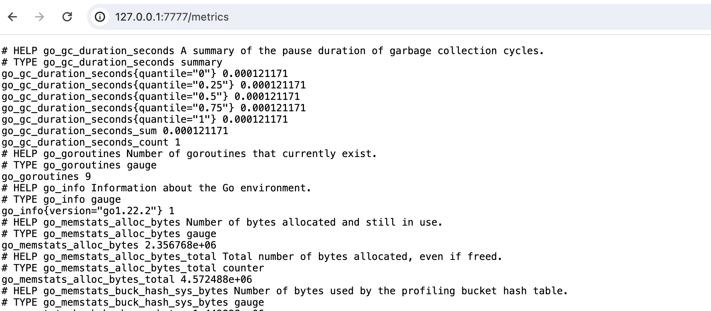

<text-box variant='learningObjectives' name='Learning Objectives'>

After this section, you can

- Create a complex microservice architecture with NATS as the messaging system

</text-box>

[Message queues](https://en.wikipedia.org/wiki/Message_queue) are a method for communication between services. They have a wide range of use cases and are helpful when you want to scale applications. A number of HTTP REST API services that want to communicate with each other require that the services know each other’s addresses. Whereas when using message queues, messages are sent to and received from the message queue, respectively.

In this section we will be using a messaging system called [NATS](https://docs.nats.io/), to explore the benefits of messaging. Before we get started we will have a look at the basics of NATS.

In NATS applications are communicating by sending and receiving messages. These messages are addressed and identified by [subjects](https://docs.nats.io/nats-concepts/subjects). The sender _publishes_ the message with a subject. The receivers _subscribe_ to subjects to get the published messages. In the default [publish-subscribe](https://docs.nats.io/nats-concepts/core-nats/pubsub) model of operation, all the subscribers of the subject receive the published message. It is also possible to use a [queue](https://docs.nats.io/nats-concepts/core-nats/queue) model, where each published message is given just to **one** subscriber.

NATS provides some different message delivery semantics or modes of operation. The basic functionality provided by [Core NATS](https://docs.nats.io/nats-concepts/core-nats) is _at most once_ messaging: if no subscribers are listening on the subject (no subject match), or are not active when the message is sent, the message is not received. By using the [Jetstream](https://docs.nats.io/nats-concepts/jetstream) functionality, it is also possible to achieve _at least once_ or _exactly once_ messaging with persistence.

With these in mind, we can design our first application that uses messaging for communication.

We have a data set of 100000 JSON objects that we need to do some heavy processing on and then save the processed data. Unfortunately processing a single JSON object takes so long that processing all of the data would require hours of work. To solve this I've split the application into smaller services that we can scale individually.

The [application](https://github.com/kubernetes-hy/material-example/tree/master/app9) is divided in 3 parts:

- Fetcher, which fetches unprocessed data and passes it to NATS.
- Mapper, which processes the data from NATS and after processing sends it back to NATS.
- Saver, which receives the processed data from NATS and finally (could) save it.


As mentioned the messaging in NATS is centered around _subjects_. In general, there is one subject per purpose. The app uses four subjects:


Fetcher splits the data into chunks of 100 objects and keeps a record of which chunks have not been processed. The application is designed so that the Fetcher can not be scaled.

The Fetcher subscribes to subject *mapper_status* and will wait for a Mapper to publish a message confirming that it's ready to process data. When the Fetcher receives this information, it publishes a chunk of data to subject *mapper_data* and starts again from the beginning.

As mentioned, when a mapper is ready to process more data, it publishes the info of availability to subject *mapper_status*. It also subscribes to subject *mapper_data*. When the Mapper gets a message, it processes it and publishes the processed data to subject *saver_data* and starts all over again. The subject *mapper_data* operates in [queue](https://docs.nats.io/nats-concepts/core-nats/queue) mode so each published message is received by only one Mapper.

The Saver subscribes to subject *saver_data*. Once receiving a message it saves it and publishes an acknowledgement message in the subject *processed_data*. The Fetcher subscribes to this subject and keeps track of what chunks of data have been saved. So even if any part of the application crashes all of the data will eventually be processed and saved. Also the subject *saver_data* is used in queue mode so each chunk of processed data is taken care of only one Saver.

For simplicity, saving to a database and fetching from external API are omitted from our app.

Before deploying the app, we follow [the documentation](https://docs.nats.io/running-a-nats-service/nats-kubernetes) and use Helm to install NATS into our cluster.

```console
$ helm repo add nats https://nats-io.github.io/k8s/helm/charts/
  ...
$ helm repo update
...
$ helm install my-nats nats/nats
  NAME: my-nats
  LAST DEPLOYED: Wed May  8 08:37:29 2024
  NAMESPACE: default
  STATUS: deployed
  REVISION: 1
```

The HELM chart has also installed a *nats-box* pod that contains the NATS [cli](https://docs.nats.io/using-nats/nats-tools/nats_cli):

```bash
$ app9 kubectl get po
NAME                                                     READY   STATUS    RESTARTS   AGE
my-nats-0                                                2/2     Running   0          2m12s
my-nats-box-7c8f57754-qrkd2                              1/1     Running   0          2m12s
```

We can play around with our messaging system with the pod:

```bash
kubectl exec -n default -it my-nats-box-7c8f57754-qrkd2 -- /bin/sh -l
my-nats-box-7c8f57754-qrkd2:~# nats sub test
05:46:14 Subscribing on test
...
```

We are now ready to deploy our [app](https://github.com/kubernetes-hy/material-example/tree/master/app9) that uses [nats.js](https://github.com/nats-io/nats.js) as the client library.

The **deployment.yaml** that passes the connect URL _nats://my-nats:4222_ to pods in env variable *NATS_URL* looks like the following:

```yaml
apiVersion: apps/v1
kind: Deployment
metadata:
  name: mapper-dep
spec:
  replicas: 10
  selector:
    matchLabels:
      app: mapper
  template:
    metadata:
      labels:
        app: mapper
    spec:
      containers:
        - name: mapper
          image: jakousa/dwk-app9-mapper:0bcd6794804c367684a9a79bb142bb4455096974
          env:
            - name: NATS_URL
              value: nats://my-nats:4222
---
apiVersion: apps/v1
kind: Deployment
metadata:
  name: fetcher-dep
spec:
  replicas: 1
  selector:
    matchLabels:
      app: fetcher
  template:
    metadata:
      labels:
        app: fetcher
    spec:
      containers:
        - name: fetcher
          image: jakousa/dwk-app9-fetcher:0bcd6794804c367684a9a79bb142bb4455096974
          env:
            - name: NATS_URL
              value: nats://my-nats:4222
---
apiVersion: apps/v1
kind: Deployment
metadata:
  name: saver-dep
spec:
  replicas: 1
  selector:
    matchLabels:
      app: saver
  template:
    metadata:
      labels:
        app: saver
    spec:
      containers:
        - name: saver
          image: jakousa/dwk-app9-saver:0bcd6794804c367684a9a79bb142bb4455096974
          env:
            - name: NATS_URL
              value: nats://my-nats:4222
```

After applying the deployments we can confirm that everything works by reading the logs of the fetcher - `kubectl logs fetcher-dep-7d799bb6bf-zz8hr -f`:

```bash
Ready to send #827
Sent data #827, 831 remaining
Ready to send #776
Sent data #776, 830 remaining
Ready to send #516
Sent data #516, 829 remaining
Ready to send #382
Sent data #382, 828 remaining
Ready to send #709
...
```

We'll want to monitor the state of NATS as well. NATS has a [web service](https://docs.nats.io/running-a-nats-service/nats_admin/monitoring) that provides many kinsd of data for monitoring. We can access the service from the browser with `kubectl port-forward my-nats-0 8222:8222` in <http://localhost:8222>.

We are already committed to using Prometheus for monitoring and for that, we need [prometheus-nats-exporter](https://github.com/nats-io/prometheus-nats-exporter) and some [setup](https://github.com/nats-io/prometheus-nats-exporter/tree/main/walkthrough).

We begin with the installation

```bash
helm repo add prometheus-community https://prometheus-community.github.io/helm-charts
helm repo update
helm install my-prometheus-nats-exporter prometheus-community/prometheus-nats-exporter
  LAST DEPLOYED: Wed May  8 09:37:43 2024
  NAMESPACE: default
  STATUS: deployed
  REVISION: 1
  TEST SUITE: None
  NOTES:
  1. Get the application URL by running these commands:
    export POD_NAME=$(kubectl get pods --namespace default -l "app.kubernetes.io/name=prometheus-nats-exporter,app.kubernetes.io/instance=my-prometheus-nats-exporter" -o jsonpath="{.items[0].metadata.name}")
    echo "Visit http://127.0.0.1:7777/metrics to use your application"
    kubectl port-forward $POD_NAME 7777:7777
```

The output already gives us instructions on how we can connect to the exported with the browser. Let us do it to ensure that everything works:



Connecting Prometheus to the exporter will require a new resource [ServiceMonitor](https://github.com/prometheus-operator/prometheus-operator/blob/main/Documentation/user-guides/getting-started.md), which is another [Custom Resource Definition](https://kubernetes.io/docs/concepts/extend-kubernetes/api-extension/custom-resources/) (CDR).

Let us start with the following incomplete **servicemonitor.yaml**

```yaml
apiVersion: monitoring.coreos.com/v1
kind: ServiceMonitor
metadata:
  name: monitoring-nats
  namespace: prometheus
  # We need a label so that Prometheus knows to listen to this
spec:
  selector:
    matchLabels:
    # We also need a label which we want to listen
  endpoints:
    - interval: 10s
      path: /metrics
      port: # We need to define the port which should be listened
  namespaceSelector:
    matchNames:
      - default
```

Let's fill in the missing data with a bit of detective work. Let's use the label the already existing ServiceMonitors use for now. We can check it with the following.

```console
$ kubectl -n prometheus get prometheus
  NAME                                    VERSION   REPLICAS   AGE
  kube-prometheus-stack-1602-prometheus   v2.18.2   1          39h

$ kubectl describe prometheus -n prometheus kube-prometheus-stack-1602-prometheus
...
 Service Monitor Selector:
    Match Labels:
      Release:  kube-prometheus-stack-1602180058
...
```

So the label needs to be "release: kube-prometheus-stack-1602180058" unless we'd like to define a new Prometheus resource. The port has been set by my-nats so we can find out the name with

```console
$ kubectl describe svc my-nats
  Port:              metrics  7777/TCP
  TargetPort:        7777/TCP
  Endpoints:         10.42.1.31:7777
```

And the label we want to listen can be found with `kubectl describe`. I found the label `app.kubernetes.io/name=nats`

So finally we can fill it with

```console
apiVersion: monitoring.coreos.com/v1
kind: ServiceMonitor
metadata:
  name: monitoring-nats
  namespace: prometheus
  labels:
    release: kube-prometheus-stack-1602180058
spec:
  selector:
    matchLabels:
      app.kubernetes.io/name: nats
  endpoints:
    - interval: 10s
      path: /metrics
      port: metrics
  namespaceSelector:
    matchNames:
      - default
```

And now Prometheus has access to the new data. Let's check Prometheus:

```console
$ kubectl -n prometheus port-forward prometheus-kube-prometheus-stack-1602-prometheus-0 9090
Forwarding from 127.0.0.1:9090 -> 9090
Forwarding from [::1]:9090 -> 9090
```

And then Prometheus API should return a result:

```console
$ curl 'http://localhost:9090/api/v1/query?query=nats_varz_cpu'
  {"status":"success","data":{"resultType":"vector","result":[{"metric":{"__name__":"nats_varz_cpu","endpoint":"metrics","instance":"10.42.1.31:7777","job":"my-nats","namespace":"default","pod":"my-nats-0","server_id":"NDYRLXL5ULWCAH7F3HRSIGHEENDQJGCJRLREAZY46FBPREIED4F24YQS","service":"my-nats"},"value":[1593781676.273,"2"]}]}}
```

If the result here is empty then something is wrong, the result may be a success even if the query doesn't make sense.

Now we just need to add a Grafana dashboard for the data. Let's import a dashboard from [here](https://raw.githubusercontent.com/nats-io/prometheus-nats-exporter/5084a32850823b59069f21f3a7dde7e488fef1c6/walkthrough/grafana-nats-dash.json) instead of configuring our own. Note that the dashboard resources are defined as "gnatsd_XXXX" whereas our resources as seen from the Prometheus Exporter `kubectl port-forward my-nats-0 7777:7777` in [http://127.0.0.1:7777/metrics](http://127.0.0.1:7777/metrics) are "nats_XXXX" - so we need to search and replace all "gnatsd_XXXX" with "nats_XXXX" in the dashboard for the data to pass correctly from prometheus.

```console
$ kubectl -n prometheus port-forward kube-prometheus-stack-1602180058-grafana-59cd48d794-4459m 3000
```

Here we can paste the JSON to "import via panel json" and then choose Prometheus as the source on the following page.


And now we have a simple dashboard with data:


This is now the final configuration:


<exercise name='Exercise 4.06: Project v2.0'>

  Create a new separate service for sending status messages of the todos to a popular chat application. Let's call the new service "broadcaster".

  Requirements:
  1. The backend saving / updating todos should send a message to NATS
  2. The broadcaster should subscribe to NATS messages
  3. The broadcaster should send the message forward to an external service in a format they support

  Choose either:
   - Telegram
   - Slack
   - Discord

  or if you don't want to use them use "Generic" where an URL is set as an Environment variable and the payload is e.g.

```json
{
  "user": "bot",
  "message": "A todo was created"
}
```

  The broadcaster should be able to be scaled without sending the message multiple times. Test that it can run with 6 replicas without issues. The messages only have to be sent to the external service if all of the services are working correctly. So a randomly missing message is not an issue but a duplicate is.

  Example of a working broadcaster:
  

  You should not write the API key in plain text.

</exercise>
