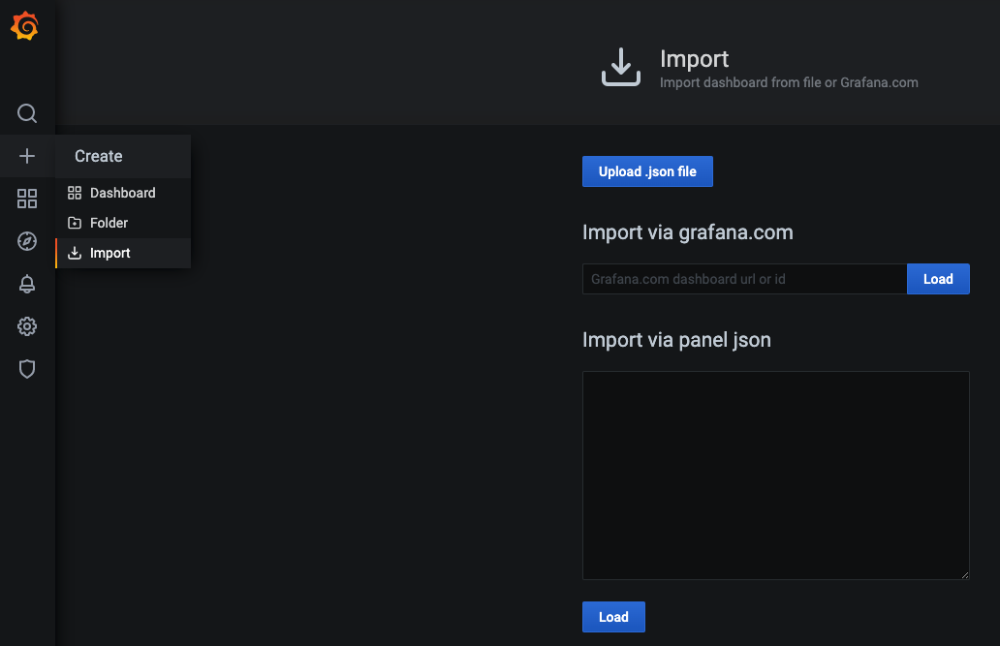

<text-box variant='learningObjectives' name='Learning Objectives'>

After this section you can

- Create a complex microservice architecture with NATS as the messaging system

</text-box>

Message Queues are a method for communication between services. They have a wide range of use cases and are helpful when you want to scale applications. A number of HTTP REST API services that want to communicate with each other require that the services know each other’s addresses. Whereas when using message queues, messages are sent to and received from the message queue, respectively.

The section headline "Message Queues" can unfortunately be a little bit misleading. We will be using [NATS](https://docs.nats.io/), a "messaging system", to explore the benefits of messaging. Before we get started we will need to discuss the differences between NATS and a more conventional message queue.

With NATS we can implement "at-most-once" messaging between our services. Conventionally message queues can persist the messages until another service consumes it. For example, in a case where none of the handlers for a message are available. "NATS Streaming", or STAN, is the opposite of NATS and would offer us "at-least-once" messaging with persistence.

This in mind we can design our first application that uses messages for communication.

We have a data set of 100 000 JSON objects that we need to do some heavy processing on and then save the processed data. Unfortunately processing a single json object takes so long that processing all of the data would require hours of work. To solve this I've split the application into smaller services that we can scale individually.

The application is in 3 parts, for simplification the saving to a database and fetching from external API are omitted:

- Fetcher, which fetches unprocessed data and passes it to NATS.
- Mapper, which processes the data from NATS and after processing sends it back to NATS.
- Saver, which receives the processed data from NATS and finally (could) save it.


**deployment.yaml**

```yaml
apiVersion: apps/v1
kind: Deployment
metadata:
  name: mapper-dep
spec:
  replicas: 10
  selector:
    matchLabels:
      app: mapper
  template:
    metadata:
      labels:
        app: mapper
    spec:
      containers:
        - name: mapper
          image: jakousa/dwk-app9-mapper:0bcd6794804c367684a9a79bb142bb4455096974
---
apiVersion: apps/v1
kind: Deployment
metadata:
  name: fetcher-dep
spec:
  replicas: 1
  selector:
    matchLabels:
      app: fetcher
  template:
    metadata:
      labels:
        app: fetcher
    spec:
      containers:
        - name: fetcher
          image: jakousa/dwk-app9-fetcher:0bcd6794804c367684a9a79bb142bb4455096974
---
apiVersion: apps/v1
kind: Deployment
metadata:
  name: saver-dep
spec:
  replicas: 1
  selector:
    matchLabels:
      app: saver
  template:
    metadata:
      labels:
        app: saver
    spec:
      containers:
        - name: saver
          image: jakousa/dwk-app9-saver:0bcd6794804c367684a9a79bb142bb4455096974
```

In this case the application is designed so that Fetcher can not be scaled. Fetcher splits the data into chunks of 100 objects and keeps a record of which chunks have not been processed. Fetcher will wait for a Mapper to send a message confirming that it's listening before sending data forward. Note how the available Mapper will be the one to receive the message so the fastest Mapper could process a large number of chunks while some of them might crash or be extremely slow. Saver will send a confirmation to Fetcher when a chunk has been saved and it will mark it as processed. So even if any part of the application crashes all of the data will be processed and saved.

We're going to use Helm to install NATS into our cluster.

```console
$ helm repo add nats https://nats-io.github.io/k8s/helm/charts/
  ...
$ helm repo update
...
$ helm install my-nats nats/nats
  NAME: my-nats
  LAST DEPLOYED: Thu Jul  2 15:04:56 2020
  NAMESPACE: default
  STATUS: deployed
  REVISION: 1
  TEST SUITE: None
  NOTES:
  You can find more information about running NATS on Kubernetes
  in the NATS documentation website:

    https://docs.nats.io/nats-on-kubernetes/nats-kubernetes

  NATS Box has been deployed into your cluster, you can
  now use the NATS tools within the container as follows:

    kubectl exec -n default -it my-nats-box -- /bin/sh -l

    nats-box:~# nats-sub test &
    nats-box:~# nats-pub test hi
    nats-box:~# nc my-nats 4222

  Thanks for using NATS!
```

This added NATS into the cluster. At this state however, the applications don't know where the NATS is so we'll add that to each of the deployments

**deployment.yaml**

```yaml
      ...
      containers:
        - name: mapper
          image: jakousa/dwk-app9-mapper:0bcd6794804c367684a9a79bb142bb4455096974
          env:
            - name: NATS_URL
              value: nats://my-nats:4222
      ...
          image: jakousa/dwk-app9-fetcher:0bcd6794804c367684a9a79bb142bb4455096974
          env:
            - name: NATS_URL
              value: nats://my-nats:4222
      ...
          image: jakousa/dwk-app9-saver:0bcd6794804c367684a9a79bb142bb4455096974
          env:
            - name: NATS_URL
              value: nats://my-nats:4222
```

After applying the modified deployments we can confirm that everything is working here by reading the logs of the fetcher - `kubectl logs fetcher-dep-7d799bb6bf-zz8hr -f`. We'll want to monitor the state of NATS as well. Fortunately it already has a Prometheus Exporter included in port 7777. We can access from browser with `kubectl port-forward my-nats-0 7777:7777` in [http://127.0.0.1:7777/metrics](http://127.0.0.1:7777/metrics) to confirm that it works. Connecting Prometheus to the exporter will require a new resource ServiceMonitor, a CRD (Custom Resource Definition).

**servicemonitor.yaml**

```yaml
apiVersion: monitoring.coreos.com/v1
kind: ServiceMonitor
metadata:
  name: monitoring-nats
  namespace: prometheus
  # We need a label so that Prometheus knows to listen to this
spec:
  selector:
    matchLabels:
      app: my-nats
  endpoints:
    - interval: 10s
      path: /metrics
      port: # We need to define the port which should be listened
  namespaceSelector:
    matchNames:
      - default
```

Let's fill in the missing data with a bit of detective work. Let's use the label the already existing ServiceMonitors use for now. We can check it with the following.

```console
$ kubectl -n prometheus get prometheus
  NAME                                    VERSION   REPLICAS   AGE
  kube-prometheus-stack-1602-prometheus   v2.18.2   1          39h

$ kubectl describe prometheus -n prometheus kube-prometheus-stack-1602-prometheus
...
 Service Monitor Selector:
    Match Labels:
      Release:  kube-prometheus-stack-1602180058
...
```

So the label needs to be "release: kube-prometheus-stack-1602180058" unless we'd like to define a new Prometheus resource. The port has been set by my-nats so we can find out the name with

```console
$ kubectl describe svc my-nats
  Port:              metrics  7777/TCP
  TargetPort:        7777/TCP
  Endpoints:         10.42.1.31:7777
```

So finally we can fill it with

```console
apiVersion: monitoring.coreos.com/v1
kind: ServiceMonitor
metadata:
  name: monitoring-nats
  namespace: prometheus
  labels:
    release: kube-prometheus-stack-1602180058
spec:
  selector:
    matchLabels:
      app: my-nats
  endpoints:
    - interval: 10s
      path: /metrics
      port: metrics
  namespaceSelector:
    matchNames:
      - default
```

And now Prometheus has access to the new data. Let's check Prometheus:

```console
$ kubectl -n prometheus port-forward prometheus-kube-prometheus-stack-1602-prometheus-0 9090
Forwarding from 127.0.0.1:9090 -> 9090
Forwarding from [::1]:9090 -> 9090
```

And then Prometheus API should return a result:

```console
$ curl 'http://localhost:9090/api/v1/query?query=nats_varz_cpu'
  {"status":"success","data":{"resultType":"vector","result":[{"metric":{"__name__":"nats_varz_cpu","endpoint":"metrics","instance":"10.42.1.31:7777","job":"my-nats","namespace":"default","pod":"my-nats-0","server_id":"NDYRLXL5ULWCAH7F3HRSIGHEENDQJGCJRLREAZY46FBPREIED4F24YQS","service":"my-nats"},"value":[1593781676.273,"2"]}]}}
```

If the result here is empty then something is wrong, the result may be a success even if the query doesn't make sense.

Now we just need to add a Grafana dashboard for the data. Let's import a dashboard from [here](https://raw.githubusercontent.com/nats-io/prometheus-nats-exporter/5084a32850823b59069f21f3a7dde7e488fef1c6/walkthrough/grafana-nats-dash.json) instead of configuring our own. Note that the dashboard resources are defined as "gnatsd_XXXX" whereas our resources as seen from the Prometheus Exporter `kubectl port-forward my-nats-0 7777:7777` in [http://127.0.0.1:7777/metrics](http://127.0.0.1:7777/metrics) are "nats_XXXX" - so we need to search and replace all "gnatsd_XXXX" with "nats_XXXX" in the dashboard for the data to pass correctly from prometheus.

```console
$ kubectl -n prometheus port-forward kube-prometheus-stack-1602180058-grafana-59cd48d794-4459m 3000
```

Here we can paste the JSON to "import via panel json" and then choose Prometheus as the source on the following page.




And now we have a simple dashboard with data:


This is now the final configuration:


<exercise name='Exercise 4.06: Project v2.0'>

  Create a new separate service for sending status messages of the todos to a popular chat application. Let's call the new service "broadcaster".

  Requirements:
  1. The backend saving / updating todos should send a message to NATS
  2. The broadcaster should subscribe to NATS messages
  3. The broadcaster should send the message forward to an external service in a format they support

  Choose either:
   - Telegram
   - Slack
   - Discord

  or if you don't want to use them use "Generic" where an URL is set as an Environment variable and the payload is e.g.

```json
{
  "user": "bot",
  "message": "A todo was created"
}
```

  The broadcaster should be able to be scaled without sending the message multiple times. Test that it can run with 6 replicas without issues. The messages only have to be sent to the external service if all of the services are working correctly. So a randomly missing message is not an issue but a duplicate is.

  Example of a working broadcaster:
  

  You should not write the API key in plain text.

</exercise>

<quiz id="de114052-aefa-47ca-880c-87f2350a63b6"></quiz>
