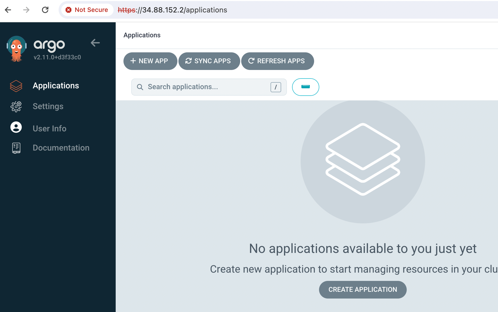
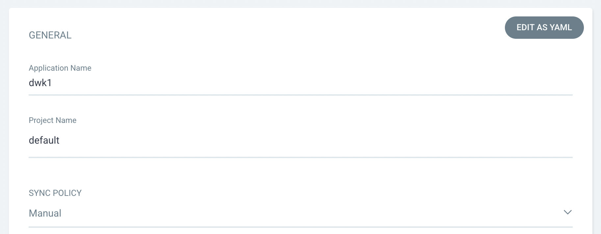
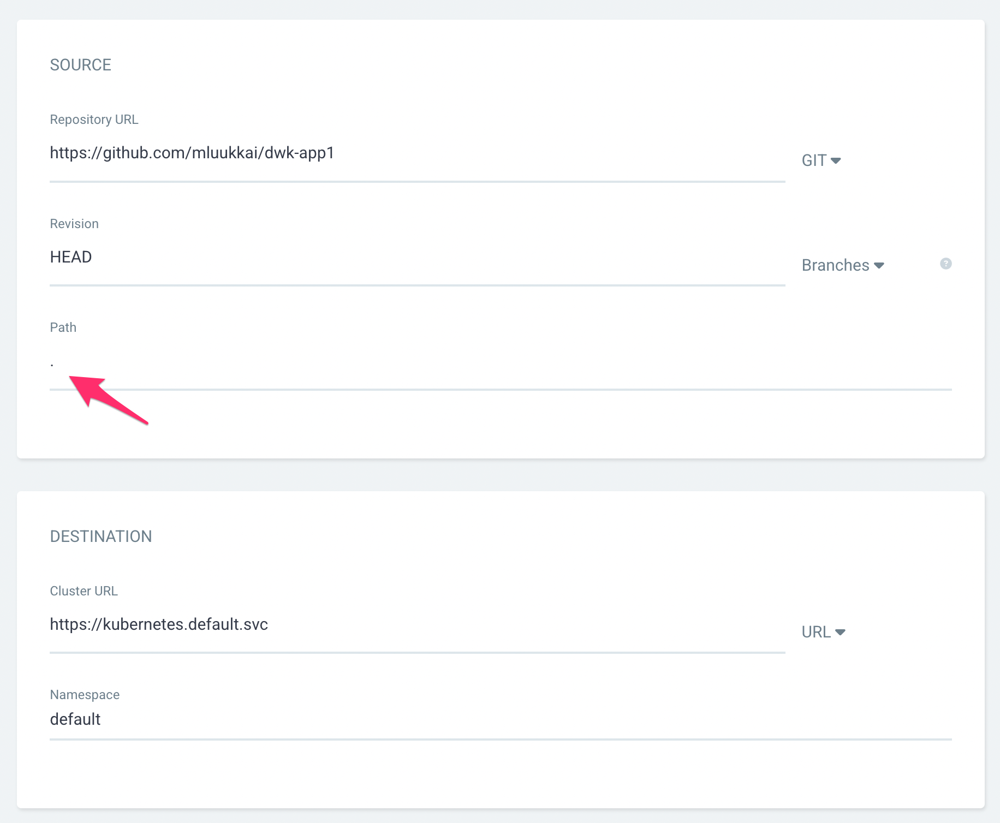
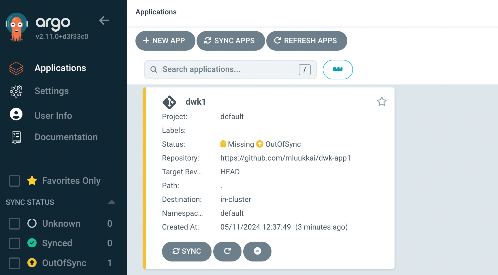
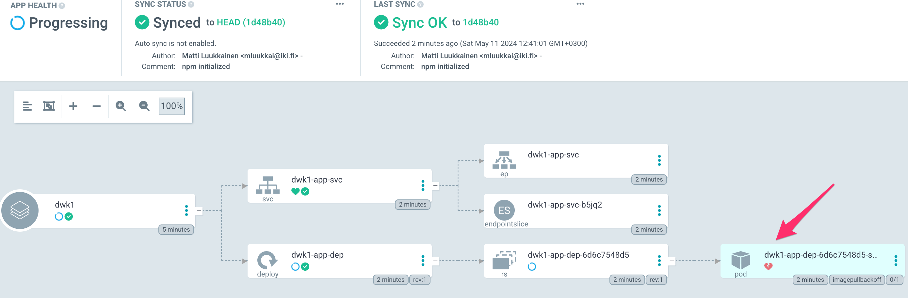
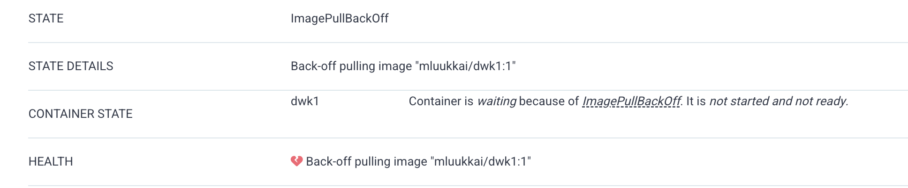
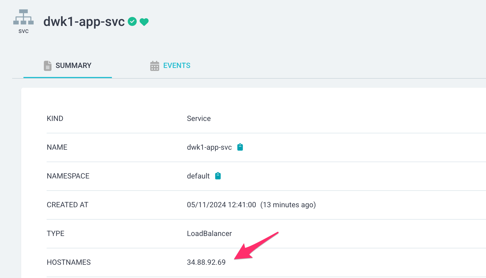
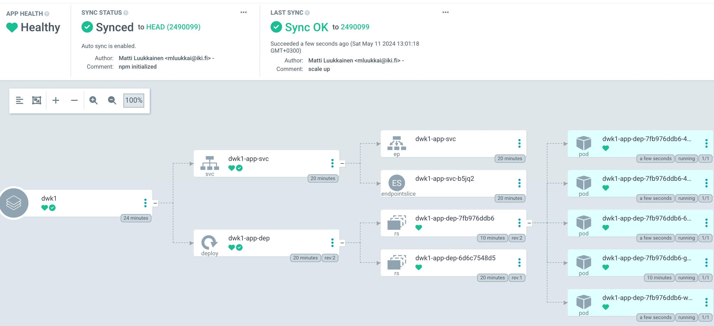
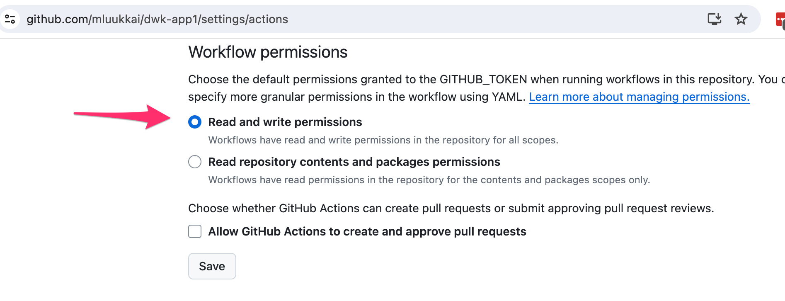

<text-box variant='learningObjectives' name='Learning Objectives'>

After this section, you can

- compare GitOps to other deployment methods

- compare traditional push deployment to a pull deployment

- implement GitOps in your Kubernetes cluster

</text-box>

An average simple deployment pipeline we have used and learned about is something like this.

1. Developer runs git push with modified code. E.g. to GitHub
2. This triggers a CI/CD service to start running. E.g. to GitHub actions
3. CI/CD service runs tests, builds an image, pushes the image to a registry and deploys the new image. E.g. to Kubernetes

This is called a push deployment. It is a descriptive name as everything is pushed forward by the previous step. There are some challenges with the push approach. For example, if we have a Kubernetes cluster that is unavailable for external connections i.e. the cluster on your local machine or any cluster we don't want to give outsiders access to. In those cases having CI/CD push the update to the cluster is not possible.

In a pull configuration the setup is reversed. We can have the cluster, running anywhere, **pull** the new image and deploy it automatically. The new image will still be tested and built by the CI/CD. We simply relieve the CI/CD of the burden of deployment and move it to another system that is doing the pulling.

<text-box name="Watchtower" variant="hint">

If you completed DevOps with Docker you may have heard about [watchtower](https://github.com/containrrr/watchtower) which enabled us to change the last pushes of a deployment pipeline to pulls when running services with docker-compose.

</text-box>

GitOps is all about this reversal and promotes good practices for the operations side of things. This is achieved by having the state of the cluster be in a git repository. So besides handling the application deployment it will handle all changes to the cluster. This will require some additional configuration and rethinking past the tradition of server configuration. But when we get there GitOps will be the final nail in the coffin of imperative cluster management.


[ArgoCD](https://argo-cd.readthedocs.io/en/stable/) is the tool of choice. At the end our workflow should look like this:

1. Developer runs git push with modified code or configurations.
2. CI/CD service (GitHub Actions in our case) starts running.
3. CI/CD service builds and pushes new image *and* commits edit to the "release" branch (main in our case)
4. ArgoCD will take the state described in the release branch and set it as the state of our cluster.

Let us start by installing ArgoCD by following the [Detting started](https://argo-cd.readthedocs.io/en/stable/getting_started/) of the docs:

```bash
kubectl create namespace argocd
kubectl apply -n argocd -f https://raw.githubusercontent.com/argoproj/argo-cd/stable/manifests/install.yaml
```

Now ArgoCD is up and running in our cluster. We still need to open access to it. There are several [optins](https://argo-cd.readthedocs.io/en/stable/getting_started/#3-access-the-argo-cd-api-server). We shall use the LoadBalancer. So we'll give the command

```bash
kubectl patch svc argocd-server -n argocd -p '{"spec": {"type": "LoadBalancer"}}'
```

After a short wait, the cluster has provided us with an external IP:

```bash
$ kubectl get svc -n argocd
NAME               TYPE           CLUSTER-IP    EXTERNAL-IP   PORT(S)                      AGE
...
argocd-server      LoadBalancer   10.7.5.82     34.88.152.2   80:32029/TCP,443:30574/TCP   17min
```

The initial password for the _admin_ account is auto-generated and stored as clear text in the field password in a secret named _argocd-initial-admin-secret_ in your Argo CD installation namespace. So we get it by base64 decoding the value that we get with the command

```bash
kubectl get -n argocd secrets argocd-initial-admin-secret -o yaml
```

We can now login:



Let us now deploy the simple app in <https://github.com/mluukkai/dwk-app1> using ArgoCD. We start by clicking _New app_ and fill the form that opens:



At the start, we decided to have a _manual sync policy_.



Note that since the definition (in our case file _kustomization.yaml_) is in the repository root, we have defined the _path_ to having the value ., that is, the character _period_.

The app is created but is is missing and not in sync, since we selected the manual sync policy:



Let us sync it and go to the app page:



Something seems to be wrong, the pod has a _broken heart_ symbol. We could now start our usual debugging process starging with `kubectl get po`. We see the same info from ArgoCD by clicking the pod:



Ok, we have specified a image that does not exist. Let us fix it in GitHub by changing _kustomization.yaml_ as follows:

´´´yaml
apiVersion: kustomize.config.k8s.io/v1beta1
kind: Kustomization
resources:
- manifests/deployment.yaml
- manifests/service.yaml
images:
- name: PROJECT/IMAGE
  newName: mluukkai/dwk1
´´´

When we sync the changes in ArgoCD, a new healthy pod is started and our app is up and running!

We can check the external IP either from command line with _kubectl_ or clicking the service:



Let us now change the sync mode to _automatic_ by clicking the _Details_ from the app page in ArgoCD.

Now all the configuration changes that we make to GitHub should be automatically applied by ArgoCD. Let us scale up the deployment to have 5 pods:

´´´yaml
apiVersion: apps/v1
kind: Deployment
metadata:
  name: dwk1-app-dep
spec:
  replicas: 5
  selector:
    matchLabels:
      app: dwk1-app
  template:
    ...
´´´

After a small wait (the default sync frequency of ArgoCD is 180 seconds), app gets synchronized and 5 pods are up and running:



Besides services, deployments and pods, the app configuration tree shows also some other objects. We see that there is a
[ReplicaSet](https://kubernetes.io/docs/concepts/workloads/controllers/replicaset/) (in figure _rs_) in between deployment and the pods. A ReplicaSet is a Kubernetes object that ensures there is always a stable set of running pods for a specific workload. The ReplicaSet configuration defines a number of identical pods required, and if a pod is evicted or fails, creates more pods to compensate for the loss. Users do not usually define ReplicaSets directly, instead Deployments are used. A Deployment then creates a ReplicaSet that takes care of running the pod replicas.

The changes in app Kubernetes configurations that we make to GitHub are now nicely synched to the cluster. How about the changes in the app?

In order to deploy a new app version, we should change the image that is used in the deployment. Currently the image is defined in the file _kustomization.yaml_:

´´´yaml
apiVersion: kustomize.config.k8s.io/v1beta1
kind: Kustomization
resources:
- manifests/deployment.yaml
- manifests/service.yaml
images:
- name: PROJECT/IMAGE
  newName: mluukkai/dwk1
´´´

So to deploy a new the app, we should

1. create a new image with possibly a new tag
2. change the kustomization.yaml to use the new image
3. push changes to GitHub

Surely this could be done manually but that is not enough for us. Let us now define a GitHub Actions workflow that does all these steps.

The first step is already familiar for us from [part 3](/part-3/2-deployment-pipeline)

The step 2 can be done with the command _kustomize edit_:

´´´yaml
$ kustomize edit set image PROJECT/IMAGE=node:20
$ cat kustomization.yaml
apiVersion: kustomize.config.k8s.io/v1beta1
kind: Kustomization
resources:
- manifests/deployment.yaml
- manifests/service.yaml
images:
- name: PROJECT/IMAGE
  newName: node
  newTag: "20"
´´´

As we see, the command _changes_ the file _kustomization.yaml_. So all that is left is to commit the file to the repository. Fortunately there is a ready made GitHub Action [add-and-commit](https://github.com/EndBug/add-and-commit) for that!

The workflow looks the following:

```yaml
name: Build and publish application

on:
  push:

jobs:
  build-publish:
    name: Build, Push, Release
    runs-on: ubuntu-latest

    steps:
      - name: Checkout
        uses: actions/checkout@v4

      - name: Login to Docker Hub
        uses: docker/login-action@v3
        with:
          username: ${{ secrets.DOCKERHUB_USERNAME }}
          password: ${{ secrets.DOCKERHUB_TOKEN }}

      # tag image with the GitHub SHA to get a unique tag
      - name: Build and publish backend
        run: |-
          docker build --tag "mluukkai/dwk1:$GITHUB_SHA" .
          docker push "mluukkai/dwk1:$GITHUB_SHA"

      - name: Set up Kustomize
        uses: imranismail/setup-kustomize@v2

      - name: Use right image
        run: kustomize edit set image PROJECT/IMAGE=mluukkai/dwk1:$GITHUB_SHA

      - name: commit kustomization.yaml to GitHub
        uses: EndBug/add-and-commit@v9
        with:
          add: 'kustomization.yaml'
          message: New version released ${{ github.sha }}
```

There is still one more to do, from the repository settings we must give the GitHub Actions permission to write to our repository:



We are now set, all changes to configurations and to the app code are now deployed automatically by ArcoCD with the help of our GitHub Action workflow, so nice!


With GitOps we achieve the following:

* Better security
  - Nobody needs access to the cluster, not even CI/CD services. No need to share access to the cluster with collaborators; they will commit changes like everyone else.

* Better transparency
  - Everything is declared in the GitHub repository. When a new person joins the team they can check the repository; no need to pass ancient knowledge or hidden techniques as there are none.

* Better traceability
  - All changes to the cluster are version-controlled. You will know exactly what was the state of the cluster and how it was changed and by whom.

* Risk reduction
  - If something breaks simply revert the cluster to a working commit. `git revert` and the whole cluster is in a previous state.

* Portability
  - Want to change to a new provider? Spin up a cluster and point it to the same repository - done your cluster is now there.

There are a few options for the GitOps setup. What we used here was having the configuration for the application in the same repository as the application itself. That required us to make some changes in the directory structure. Another option is to have the configuration separate from the source code. That approach also removes the risk of having a pipeline loop where your pipeline commits to the repository which then triggers the pipeline.

<exercise name='Exercise 4.08: Project v2.1'>

  Move The Project to use GitOps so that you can develop to the repository and the application is automatically updated.

</exercise>


<exercise name='Exercise 4.07: GitOpsify Cluster'>

  Move your cluster configuration to GitOps.

  Validate that everything works by deleting the cluster `k3d cluster delete` and recreating it by bootstrapping with flux.

  Application deployments can still happen in the old fashioned way.

</exercise>
