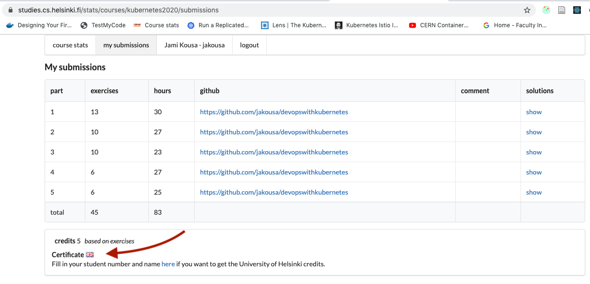
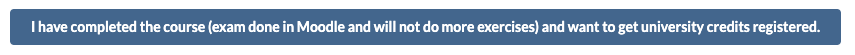
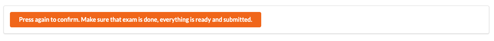

Thank you for completing the course!

After you've submitted all exercises to the submission application you should see a link to the certificate in the submission application!

Fill in your name by clicking your username in the navbar if you do not see the button.

For students looking for the ECTS credits you have already registered by now and only need to access the Moodle space and complete the "Final Exercise".
During the final exercise you are asked to press the following button. It's right below the certificate button if you have filled your name and student number.

It needs to be pressed twice.

<quiz id="e0d0bf63-d655-4b46-a887-72c14fa52cbe"></quiz>

<quiz id="a9e3d83c-1d6c-41db-aa56-c26810a854b7"></quiz>
