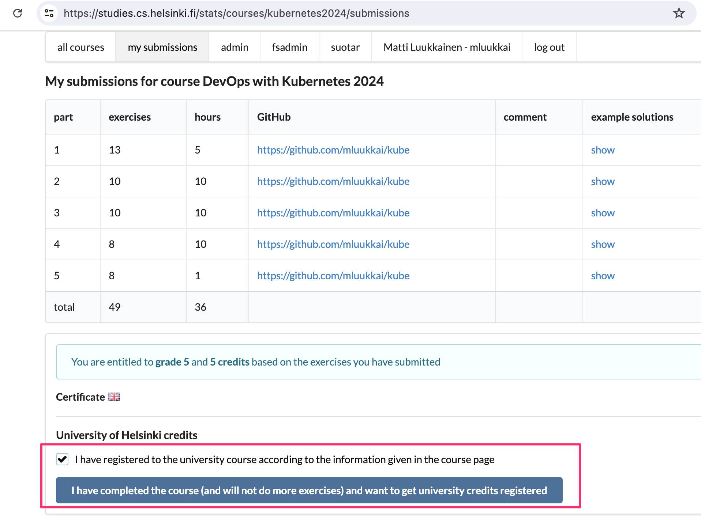

### Completing the course for credits ###

Once you have completed the exercises and want to get the credits, enroll yourself in the course through the Open University [here](https://www.avoin.helsinki.fi/palvelut/esittely.aspx?s=otm-a3afed42-efa2-41af-9930-d607fc5e2808).

Let us know through the exercise submission system that you have completed the course:

Registering the credits may take up to 4 weeks.

# Certificate #

You can download the certificate for completing this part by clicking one of the flag icons. The flag icon corresponds to the certificate's language.
