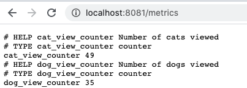
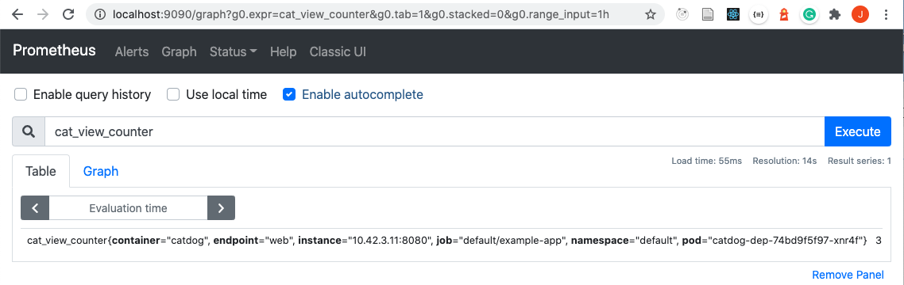
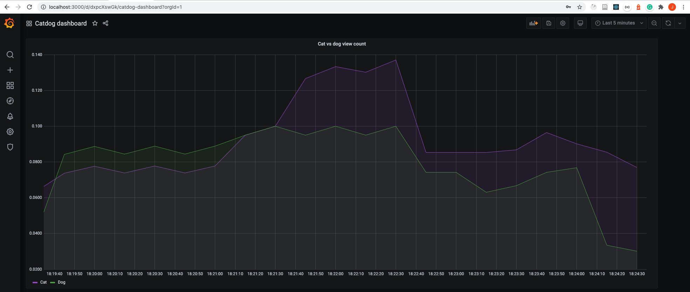

This assignment is for an extra ECTS with the title "Kubernetes workshop". By attending the Kubernetes webinar and doing this extra assignment you can get 1 extra credit.

**Enrolment for the course is required for the extra credit.** Follow the instructions on [/registration-and-completion](/registration-and-completion) to ensure you've enrolled. Unfortunately, this also means that the credits are only available if electronic enrollment is available to you, as specified on the registration and completion page.

**Deadline for the assignment is the end of the course.**

# Recap #

Shijun used the following helm chart to deploy Prometheus and Grafana (and all the other tools) to his cluster: https://github.com/prometheus-community/helm-charts/tree/main/charts/kube-prometheus-stack. The repository also has the install instructions.

In this helpful section from the kube-prometheus-stack [README](https://github.com/prometheus-community/helm-charts/tree/main/charts/kube-prometheus-stack#prometheusioscrape) we learned how to tell prometheus to scrape all "PodMonitorSelectors" and "ServiceMonitorSelector" CRDs:

```console
helm upgrade --set prometheus.prometheusSpec.podMonitorSelectorNilUsesHelmValues=false --set prometheus.prometheusSpec.serviceMonitorSelectorNilUsesHelmValues=false prometheus prometheus-community/kube-prometheus-stack
```

Also, you have already completed [/part-2/5-monitoring](/part-2/5-monitoring), which introduced you how to connect to grafana with kubectl port-forward.

# Assignment #

Create an application and setup Prometheus so that it scrapes the application for metrics and show how the metrics change over time through grafana. Follow the steps to not get overwhelmed:

### Step 0: Preparation ###

As a preparation create a new web app project, with whatever tech stack / language you choose. I **highly recommend** choosing a language from [this list](https://prometheus.io/docs/instrumenting/clientlibs/)

The app should have 3 endpoints: /cat, /dog and /random.

- /cat endpoint returns an image of a cat

- /dog endpoint returns an image of a dog

- /random endpoint returns a random image

### Step 1: Prometheus client library ###

This step will require you to read the documentation for the client libraries, choose what type the metric will be and expose the metrics through an endpoint.

Add Prometheus client library and track the usage of _each image type_. Whenever a cat image is shown increment the counter for cats, and whenever a dog is shown increment the counter for dogs.

Here's an image that confirms you've completed step 1, where the metrics are available to Prometheus in /metrics path.



### Step 2: Prometheus operator ###

This step is the most challenging and will require you to read the documentation for the [kube-prometheus-stack](https://github.com/prometheus-community/helm-charts/tree/main/charts/kube-prometheus-stack) and install Prometheus to your cluster and configure it to scrape your application.

Tip: Check the Recap section above.

You will need a *PodMonitor* Custom Resource, [docs here](https://github.com/prometheus-operator/prometheus-operator/blob/master/Documentation/design.md#podmonitor), [api doc here](https://github.com/prometheus-operator/prometheus-operator/blob/master/Documentation/api.md#podmonitor) and an [example here](https://github.com/prometheus-operator/prometheus-operator/blob/master/example/user-guides/getting-started/example-app-pod-monitor.yaml)

Interestingly, while according to API documentation, the PodMonitor only accepts the monitored port as a string value, so you will need to add a name to the port, e.g:

**podmonitor.yaml**
```yaml
  podMetricsEndpoints:
  - port: web
    path: "/metrics"
```

**deplyment.yaml**
```yaml
  containers:
    - ports:
      - name: web
        containerPort: 8080
```

Install Prometheus to your cluster and have it scrape your application. Confirm that it has the data by querying through the Prometheus UI

Here's an image that confirms you've completed step 2, the data is available to Prometheus:



### Step 3: Grafana ###

Show Grafana graph for the types of images trending.

Here's an image that confirms you've completed step 3, here the Grafana gets data from Prometheus about the cat and dog views and shows them as a rate over the last 5 minutes:



# Done, what now? #

Contact me (jami.kousa@helsinki.fi) and tell me your student number and a link to your project.
